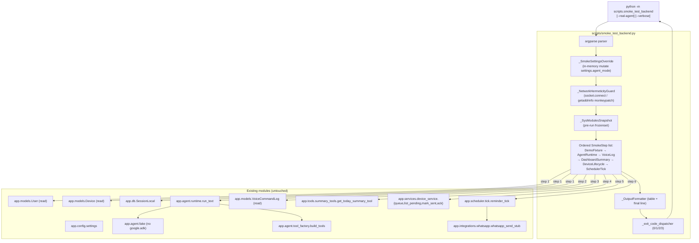
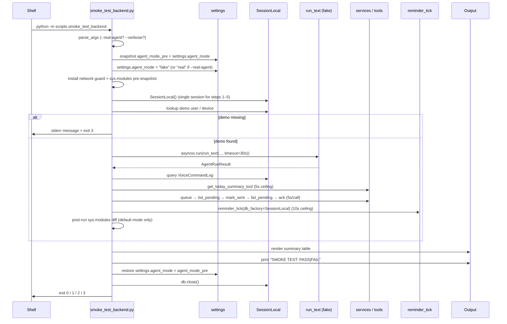

# Design Document — Phase 8.5: Integration Smoke Test Backend

## Overview

Phase 8.5 menambahkan satu CLI gate manual sebelum frontend Phase 9 dibangun. Phase 0–8 sudah selesai (186/186 test lulus) dan **tidak boleh diubah** oleh spec ini. Fokus desain ini hanya dua deliverable yang sepenuhnya aditif:

1. **`scripts/smoke_test_backend.py`** — entry point CLI Smoke Test Backend. Dipanggil sebagai `python -m scripts.smoke_test_backend`, dengan flag opsional `--real-agent` dan `--verbose`. Skrip ini melatih lima lapisan inti backend (config, DB, Service Layer, Agent Runtime, Reminder Scheduler) dalam satu proses tanpa men-start uvicorn dan tanpa membuat tabel/migration baru.
2. **`docs/SMOKE_TEST.md`** — dokumentasi cara pakai bergaya `03-runbook.md`, mencakup tujuan, prasyarat, exit code, dan tabel "Common failures".

Spec ini meredup-pakai komponen Phase 3 (`app/services/*`, `app/tools/*`), Phase 4–5 (`app/agent/runtime.py`, `app/agent/tool_factory.py`, `app/agent/fake.py`), Phase 6 (`app/scheduler/tick.py`), dan Phase 7 (`app/integrations/whatsapp.py`) **apa adanya**. Tidak ada method service-layer baru, tidak ada endpoint HTTP baru, tidak ada perubahan schema, tidak ada modul `app/agent/*` yang dipatch, dan tidak ada penyentuhan paket dev `agents/taskbot_agent/`.

### Hubungan dengan Steering Rules

- Single project-root `.env` (steering 01 §"Tech stack" dan steering 02 hard-rule 6) — Smoke Settings Override hanya memutasi `app.config.settings.agent_mode` di-memory, tidak pernah menulis `.env` (Req 1.3).
- Per-Request Tool Factory (steering 02 hard-rule 1) — Smoke Run masuk ke `run_text` yang memang sudah membangun ulang Tool Surface per pemanggilan; Smoke tidak menyentuh closure faktori secara langsung.
- Hermetic Fake Agent (steering 02 hard-rule 2) — default mode wajib menjamin `google.adk.*` dan `google.genai` tidak terimport (Req 9.1). Karena `app/agent/runtime.py` sudah men-defer import Google ke branch `_run_real`, Smoke Run dalam mode default secara struktural tidak menarik SDK; design hanya perlu menambahkan post-run snapshot diff sebagai sabuk pengaman.
- Tools never raise (steering 02 hard-rule 3) — Smoke Run menyandarkan diri pada kontrak ini saat memvalidasi `AgentRunResult.actions`.
- Async-only di runtime, sync di service layer (steering 02 §"Soft conventions") — Smoke Run memakai `asyncio.run` untuk `run_text` dan pemanggilan sync biasa untuk service/tool/scheduler.

### Keputusan Desain Kunci (rationale singkat)

| Keputusan | Alasan |
|---|---|
| **CLI satu file `scripts/smoke_test_backend.py`** (tanpa subpackage `scripts/_smoke/`). | Total kode estimasi <450 baris; dipecah lebih kecil hanya menambah indireksi tanpa menambah nilai tes. Mirroring pola `scripts/seed_dev.py` dan `scripts/run_agent_text.py` yang juga single-file. Bila implementasi ternyata melebihi ~500 baris, kita boleh mengekstrak helper ke `scripts/_smoke/` saat itu — tetapi ini bukan janji desain. |
| **Tidak ada `app/tests/test_smoke_flow.py`.** | Smoke Test Backend adalah gate manual. Mem-pytest-kan CLI berarti memunculkan subprocess shell-out atau menduplikasi logika langkah ke level pytest — keduanya menambah kompleksitas tanpa menambah invarian baru. Suite 186 test yang ada sudah memvalidasi semua komponen yang Smoke Run pakai. Smoke Test Backend sendiri adalah probe end-to-end yang dirancang untuk dieksekusi manual. Bila di masa depan kita ingin menjadikannya CI-gated, kita tambahkan modul tes terpisah saat itu. |
| **Network kill-switch dipasang oleh skrip itu sendiri**, bukan reuse fixture autouse `app/tests/conftest.py`. | Req 9.5 melarang ketergantungan ke fixture pytest karena Smoke Run dijalankan sebagai proses Python biasa, bukan via pytest. Fixture autouse hanya aktif di proses pytest. Skrip menyalin pola monkeypatch yang sama tetapi memasangnya di `socket` modul global, bukan via `monkeypatch`. |
| **Atomic Mark-Sent hanya divalidasi via re-poll setelah `mark_device_command_sent`.** | Service `mark_device_command_sent` dan `list_pending_device_commands` sudah ada (steering 01 §"Layered design"). Atomic Mark-Sent di Phase 5 (`app/api/devices.py`) memilih SELECT-then-UPDATE-in-one-transaction; Smoke Run cukup memanggil `mark_device_command_sent` lalu `list_pending_device_commands` lagi dan memverifikasi command id menghilang dari list. |
| **Timeout per langkah memakai `concurrent.futures.ThreadPoolExecutor` untuk panggilan sync, `asyncio.wait_for` untuk panggilan async.** | `signal.SIGALRM` tidak portabel di Windows (Python 3.14 di Windows adalah platform pengembangan utama, lihat steering 03 troubleshooting `_make_subprocess_transport`). `ThreadPoolExecutor.submit(...).result(timeout=N)` memberi `concurrent.futures.TimeoutError` yang bersih. Caveat diketahui: thread yang berjalan tidak bisa di-force-kill; untuk smoke test ini diterima karena proses akan exit segera. |

### Lingkup yang DILUAR Phase 8.5 (cermin Req 12)

Tidak ada uvicorn boot, tidak ada HTTP request ke `app.main:app`, tidak ada tabel/migration baru, tidak ada method `app/services/*` baru, tidak ada panggilan WhatsApp Cloud API riil, tidak ada kode/asset/build artifact frontend, dan tidak ada perubahan pada `agents/taskbot_agent/`. Semua ini adalah invariant testable dan diturunkan menjadi properti `NG1`–`NG7` di §"Correctness Properties".

## Architecture

### Diagram Komponen



### Aliran Sebuah Smoke Run



### Direktori dan File Baru

```
scripts/
└── smoke_test_backend.py        # NEW — single-file CLI, ~400 LOC

docs/
└── SMOKE_TEST.md                # NEW — runbook-style usage doc
```

Tidak ada perubahan di `app/`. Tidak ada migrasi Alembic. Tidak ada test baru di `app/tests/` (rationale dijelaskan di §"Overview"). `requirements.txt` tidak berubah karena Smoke Test Backend hanya memakai stdlib (`argparse`, `asyncio`, `concurrent.futures`, `socket`, `sys`, `traceback`, `dataclasses`, `time`, `os`, `textwrap`) plus modul Lyla-Taskbot yang sudah ada.

## Components and Interfaces

### 1. CLI Entry Point dan Argparse Layout

```python
# scripts/smoke_test_backend.py — module top-level

import argparse
import asyncio
import sys
import traceback

from app.config import settings  # imported lazily inside _apply_override too


_USAGE_PROG = "python -m scripts.smoke_test_backend"

_EXIT_PASS = 0
_EXIT_FAIL = 1
_EXIT_MISSING_KEY = 2
_EXIT_MISSING_FIXTURE = 3


def _build_parser() -> argparse.ArgumentParser:
    p = argparse.ArgumentParser(
        prog=_USAGE_PROG,
        description="Phase 8.5 backend smoke test (manual gate).",
    )
    p.add_argument(
        "--real-agent",
        action="store_true",
        help="Force agent_mode=real (requires GOOGLE_API_KEY).",
    )
    p.add_argument(
        "--verbose",
        action="store_true",
        help="On failure, print full Python traceback(s) to stderr.",
    )
    return p


def main(argv: list[str] | None = None) -> int:
    args = _build_parser().parse_args(argv)
    target_mode = "real" if args.real_agent else "fake"

    if args.real_agent and not _gemini_key_is_set(settings.google_api_key):
        print(
            "GOOGLE_API_KEY is required for --real-agent. "
            "Set it in the project-root .env and rerun, or omit --real-agent.",
            file=sys.stderr,
        )
        return _EXIT_MISSING_KEY

    return _run_smoke(target_mode=target_mode, verbose=args.verbose)


if __name__ == "__main__":
    raise SystemExit(main())
```

`_gemini_key_is_set` mengembalikan `False` saat `google_api_key` adalah `None`, `""`, atau hanya whitespace (Req 2.1, 2.2). Pemeriksaan dilakukan **sebelum** `_run_smoke` (Req 2.2), sehingga tidak ada Smoke Step yang berjalan dan tidak ada traceback yang tercetak (Req 2.3).

### 2. Smoke Settings Override (Req 1)

```python
class _SmokeOverrideError(Exception):
    """Raised when the Smoke Settings Override cannot be applied."""


class _SmokeSettingsOverride:
    """Context manager that mutates ``settings.agent_mode`` in-process.

    Implements Req 1.2, 1.4, 1.6. NEVER touches ``.env`` on disk
    (Req 1.3) — only the in-memory ``app.config.settings`` instance is
    mutated. ``settings`` is a Pydantic ``BaseSettings`` instance which
    permits attribute assignment by default.
    """

    def __init__(self, target_mode: str) -> None:
        assert target_mode in ("fake", "real")
        self._target_mode = target_mode
        self._previous_mode: str | None = None
        self._applied = False

    def __enter__(self) -> "_SmokeSettingsOverride":
        from app.config import settings as _settings

        self._previous_mode = _settings.agent_mode
        try:
            _settings.agent_mode = self._target_mode
        except Exception as exc:  # narrow at call site only if needed
            raise _SmokeOverrideError(str(exc)) from exc
        self._applied = True
        return self

    def __exit__(self, exc_type, exc, tb) -> None:
        if not self._applied:
            return
        from app.config import settings as _settings

        _settings.agent_mode = self._previous_mode
```

Pemenuhan Req 1:

| Klausa | Mekanisme |
|---|---|
| 1.1 Konfigurasi via `app.config.settings` saja | Skrip hanya `from app.config import settings`. Tidak ada panggilan `dotenv.load_dotenv` baru. |
| 1.2 Default mode → `agent_mode="fake"` sebelum step apa pun | `_run_smoke` membungkus seluruh urutan step di dalam blok `with _SmokeSettingsOverride(target_mode):` sebelum step pertama dijalankan. |
| 1.3 `.env` tidak disentuh | Override hanya menyentuh atribut `settings.agent_mode`. Tidak ada `open(".env", "w")`, tidak ada `Path(...).write_text`, tidak ada subprocess `setx`. |
| 1.4 `--real-agent` → `agent_mode="real"` | `target_mode = "real" if args.real_agent else "fake"`. |
| 1.5 Default mode tidak butuh `google_api_key` | Pengecekan `_gemini_key_is_set` hanya dijalankan saat `args.real_agent`. |
| 1.6 Restore pra-override saat exit | `__exit__` selalu memulihkan `_previous_mode` jika `_applied=True`. Blok `with` membungkus seluruh smoke run termasuk normal-exit dan exception. |
| 1.7 Override gagal → step gagal, lanjut step lain | `_run_smoke` menangkap `_SmokeOverrideError` dan menyisipkan baris `Settings Override` sebagai gagal di tabel; step Req 3–8 tetap dieksekusi dengan `settings.agent_mode` yang efektif sekarang. |

### 3. Network Hermeticity Guard (Req 9)

Dua mekanisme bekerja sama:

**A. Live socket monkeypatch.** Dipasang oleh `_NetworkHermeticityGuard.install()` setelah override settings dan sebelum step pertama. Mem-patch:

- `socket.socket.connect`
- `socket.socket.connect_ex`
- `socket.create_connection`
- `socket.getaddrinfo`

Logikanya menyalin pola di `app/tests/conftest.py` (yang **tidak** kita reuse karena Req 9.5), tetapi dipasang lewat penugasan langsung ke modul `socket` agar aktif tanpa pytest. Saat `target_mode == "fake"` allowlist hanya berisi alamat loopback (`{"127.0.0.1", "::1", "localhost", "0.0.0.0"}`). Saat `target_mode == "real"` allowlist diperluas dengan suffix hostname Gemini (`generativelanguage.googleapis.com`, `oauth2.googleapis.com`, `accounts.google.com`) sehingga `app.agent.runtime._run_real` dapat menyelesaikan dan terhubung ke Gemini API (Req 9.4). Setiap upaya outbound ke alamat di luar allowlist memicu `_NetworkHermeticityViolation(destination=address)` yang ditangkap oleh wrapper step yang sedang berjalan dan dilaporkan sebagai FAIL pada baris step itu (Req 9.3).

**B. Post-run `sys.modules` diff (default mode saja).** Sebelum step pertama dijalankan, skrip menyimpan `frozenset(sys.modules)` ke `_pre_modules`. Setelah step terakhir selesai (apa pun hasilnya), skrip menghitung delta untuk modul yang nama-modulnya cocok dengan regex `^google\.(adk|genai)(\.|$)` atau `^google_adk(\.|$)`. Jika delta non-kosong dalam default mode, run dianggap FAIL dan satu baris ekstra "Network Hermeticity (post-run)" ditambahkan ke tabel dengan daftar modul yang baru terimpor. Diff ini **dilewati** dalam `--real-agent` mode karena `_run_real` memang sengaja meng-import `google.adk.runners` dan `google.genai`.

```python
class _NetworkHermeticityViolation(RuntimeError):
    """Raised by the patched socket primitives when an outbound non-allowlist
    destination is contacted during a Smoke Run."""


_LOOPBACK_HOSTS: frozenset[str] = frozenset(
    {"127.0.0.1", "::1", "localhost", "0.0.0.0"}
)
_GEMINI_HOST_SUFFIXES: tuple[str, ...] = (
    "generativelanguage.googleapis.com",
    "oauth2.googleapis.com",
    "accounts.google.com",
)


class _NetworkHermeticityGuard:
    def __init__(self, *, allow_gemini: bool) -> None:
        self._allow_gemini = allow_gemini
        self._originals: dict[str, object] = {}
        self._installed = False

    def install(self) -> None: ...     # mem-patch socket.* attributes
    def uninstall(self) -> None: ...   # restore originals from self._originals

    def _is_allowed(self, address: object) -> bool:
        # loopback always allowed; Gemini suffix only when self._allow_gemini.
        ...
```

Pemenuhan Req 9:

| Klausa | Mekanisme |
|---|---|
| 9.1 `google.adk` / `google.genai` tidak terimport baru di default mode | `_pre_modules` snapshot + post-run diff. |
| 9.2 No outbound non-loopback (HTTP/HTTPS/TCP/UDP/DNS) di default mode | Socket monkeypatch dengan allowlist hanya loopback. `getaddrinfo` juga di-guard agar resolve DNS ke non-loopback langsung gagal. |
| 9.3 Pelanggaran → step FAIL dengan destination | Wrapper step menangkap `_NetworkHermeticityViolation` dan menyimpan `repr(address)` ke `error_message`. |
| 9.4 `--real-agent` → Gemini hanya via `app/agent/runtime.py` | Allowlist hostname hanya berisi domain Gemini/Google Auth. Skrip sendiri tidak mengimport `google.*`; satu-satunya jalur yang melakukannya adalah `_run_real` yang dipanggil oleh `run_text` (steering 02 hard-rule 6 + isi `runtime.py`). |
| 9.5 Aktif tanpa pytest, tidak bergantung fixture | Patch dipasang langsung ke modul `socket` via `setattr`; tidak memakai `monkeypatch` fixture. Tidak ada `import app.tests.conftest`. |

### 4. SmokeStep, SmokeContext, SmokeStepResult

```python
from dataclasses import dataclass, field

@dataclass
class SmokeStepResult:
    name: str
    status: str                                 # "PASS" | "FAIL" | "SKIP"
    error_message: str | None = None            # one-line, ≤200 chars + "…"
    error_traceback: str | None = None          # full traceback, --verbose only

@dataclass
class SmokeContext:
    db: object                                  # SQLAlchemy Session
    user_id: str | None = None                  # populated by step 1
    device_id: str | None = None                # populated by step 1
    agent_result: object | None = None          # populated by step 2
    queued_command_id: str | None = None        # populated by step 5
    target_mode: str = "fake"                   # "fake" | "real"
    skip_after: set[str] = field(default_factory=set)
                                                # step names to mark SKIP

class SmokeStep:
    name: str

    def run(self, ctx: SmokeContext) -> SmokeStepResult: ...
```

Daftar step (urutan tetap, sesuai Req 10.1):

| # | `SmokeStep.name` | Implementasi | Req |
|---|---|---|---|
| 1 | `Demo Fixture Lookup` | `_DemoFixtureLookupStep` | 3 |
| 2 | `Agent Runtime (fake)` | `_AgentRuntimeStep` | 4 |
| 3 | `VoiceCommandLog Persistence` | `_VoiceLogStep` | 5 |
| 4 | `Dashboard Summary Read-Back` | `_DashboardSummaryStep` | 6 |
| 5 | `Device Command Lifecycle` | `_DeviceLifecycleStep` | 7 |
| 6 | `Scheduler Tick` | `_SchedulerTickStep` | 8 |

Cross-cutting (tidak menjadi baris pasti di tabel, tapi dapat menambah baris saat melanggar):

- `Settings Override` — hanya muncul jika Req 1.7 trigger.
- `Network Hermeticity (post-run)` — hanya muncul jika post-run sys.modules diff non-kosong di default mode.

### 5. Step 1 — Demo Fixture Lookup (Req 3)

```python
DEMO_USER_EMAIL = "demo@taskbot.local"
DEMO_DEVICE_CODE = "TASKBOT-DEMO-001"


class _DemoFixtureLookupStep(SmokeStep):
    name = "Demo Fixture Lookup"

    def run(self, ctx: SmokeContext) -> SmokeStepResult:
        from app.models.user import User
        from app.models.device import Device

        users = ctx.db.query(User).filter(User.email == DEMO_USER_EMAIL).all()
        devices = (
            ctx.db.query(Device)
            .filter(Device.device_code == DEMO_DEVICE_CODE)
            .all()
        )
        missing: list[str] = []
        if len(users) != 1:
            missing.append(f"User(email={DEMO_USER_EMAIL!r}) count={len(users)}")
        if len(devices) != 1:
            missing.append(
                f"Device(device_code={DEMO_DEVICE_CODE!r}) count={len(devices)}"
            )
        if missing:
            # Bubble up via a dedicated exception so the dispatcher can
            # convert it into exit code 3 (Req 3.4).
            raise _DemoFixtureMissing(missing)

        ctx.user_id = users[0].id
        ctx.device_id = devices[0].id
        return SmokeStepResult(name=self.name, status="PASS")
```

`_DemoFixtureMissing` adalah exception khusus. `_run_smoke` menangkapnya, mencetak ke stderr satu baris yang mengandung literal `python -m alembic upgrade head` dan `python -m scripts.seed_dev` (Req 3.4), tidak mencetak tabel ringkasan, lalu return `_EXIT_MISSING_FIXTURE` (Req 3.4, 3.5). DB session di-close di blok `finally` (Req 3.5).

Pemenuhan Req 3:

| Klausa | Mekanisme |
|---|---|
| 3.1 Satu `SessionLocal()` sebelum step apa pun yang membaca/menulis | `_run_smoke` membuka `db = SessionLocal()` sekali sebelum step pertama. Step 1–5 berbagi session ini. Step 6 (`reminder_tick`) memakai `db_factory=SessionLocal` yang membuka session terpisah. |
| 3.2 Lookup user via `email == DEMO_USER_EMAIL`, sukses iff exactly one row | Code sample di atas. |
| 3.3 Lookup device via `device_code == DEMO_DEVICE_CODE`, sukses iff exactly one row | Code sample di atas. |
| 3.4 Pesan stderr menyebut Demo Fixture yang hilang, mengandung literal seed commands, exit 3 | `_DemoFixtureMissing.message` di-format dengan f-string yang memuat ke-2 literal command. |
| 3.5 Skip step 4–9 dan close session sebelum exit | `_DemoFixtureMissing` di-raise dari step 1; `_run_smoke` tidak mencapai loop step lain; blok `finally` memanggil `db.close()`. |

### 6. Step 2 — Agent Runtime (fake) (Req 4)

```python
import asyncio

_AGENT_TEXT = "catat makan siang 20000"
_AGENT_TIMEOUT_SECONDS = 30


class _AgentRuntimeStep(SmokeStep):
    name = "Agent Runtime (fake)"

    def run(self, ctx: SmokeContext) -> SmokeStepResult:
        from app.agent.runtime import run_text
        from app.config import settings

        try:
            result = asyncio.run(
                asyncio.wait_for(
                    run_text(
                        ctx.db,
                        user_id=ctx.user_id,
                        device_id=ctx.device_id,
                        text=_AGENT_TEXT,
                        timezone=settings.timezone,
                    ),
                    timeout=_AGENT_TIMEOUT_SECONDS,
                )
            )
        except (asyncio.TimeoutError, Exception) as exc:
            ctx.skip_after.update(
                {"VoiceCommandLog Persistence", "Dashboard Summary Read-Back"}
            )
            return _fail(self.name, exc)

        ok, err = _validate_agent_result(result)
        if not ok:
            ctx.skip_after.update(
                {"VoiceCommandLog Persistence", "Dashboard Summary Read-Back"}
            )
            return SmokeStepResult(
                name=self.name, status="FAIL", error_message=err
            )

        ctx.agent_result = result
        return SmokeStepResult(name=self.name, status="PASS")


def _validate_agent_result(result) -> tuple[bool, str | None]:
    if getattr(result, "status", None) != "success":
        return False, f"AgentRunResult.status != 'success' (got {result.status!r})"
    reply = getattr(result, "reply", None)
    if not isinstance(reply, str):
        return False, f"AgentRunResult.reply not a string (got {type(reply).__name__})"
    stripped = reply.strip()
    if not (1 <= len(stripped) <= 10_000):
        return False, f"AgentRunResult.reply length {len(stripped)} not in [1, 10000]"
    actions = getattr(result, "actions", None)
    if not isinstance(actions, list) or not (1 <= len(actions) <= 50):
        return False, f"AgentRunResult.actions length invalid (got {len(actions) if isinstance(actions, list) else type(actions).__name__})"
    for i, a in enumerate(actions):
        if not isinstance(a, dict) or "success" not in a or "type" not in a:
            return False, f"AgentRunResult.actions[{i}] missing 'success'/'type'"
    if not any(
        isinstance(a, dict)
        and a.get("type") == "expense"
        and a.get("success") is True
        for a in actions
    ):
        return False, "AgentRunResult.actions has no successful expense entry"
    return True, None
```

Catatan implementasi:

- `asyncio.run` dipakai sekali di sini karena Smoke Run sendiri adalah skrip sync. Memakai `asyncio.run` per step async memang kurang efisien, tapi step Agent Runtime adalah satu-satunya step async. Tidak ada need untuk single-loop strategy.
- Validasi predikat persis mencerminkan klausa Req 4.3–4.6.
- `ctx.skip_after.update({...})` mendaftarkan step 3 dan 4 untuk dilewati (Req 4.8). Step 5 dan 6 tetap dieksekusi.
- Tidak ada try/except yang lebih sempit dari `Exception` — Req 4.7 membutuhkan kita menangkap exception apa pun yang merembes dari `run_text` (termasuk `TimeoutError`).

### 7. Step 3 — VoiceCommandLog Persistence (Req 5)

```python
class _VoiceLogStep(SmokeStep):
    name = "VoiceCommandLog Persistence"

    def run(self, ctx: SmokeContext) -> SmokeStepResult:
        from app.models.voice_command_log import VoiceCommandLog

        rows = (
            ctx.db.query(VoiceCommandLog)
            .filter(
                VoiceCommandLog.user_id == ctx.user_id,
                VoiceCommandLog.input_text == _AGENT_TEXT,
                VoiceCommandLog.status == "success",
            )
            .all()
        )
        if len(rows) < 1:
            return SmokeStepResult(
                name=self.name,
                status="FAIL",
                error_message=(
                    f"VoiceCommandLog query matched {len(rows)} rows for "
                    f"user_id={ctx.user_id!r}, input_text={_AGENT_TEXT!r}, "
                    "status='success'"
                ),
            )
        return SmokeStepResult(name=self.name, status="PASS")
```

Pemenuhan Req 5: query memuat tepat tiga filter (`user_id`, `input_text`, `status`), pesan kegagalan menyebut `(matching-row count, user_id, input_text, status)`.

Catatan tentang sumber baris log: `app/api/agent.py` (Phase 5) memanggil `log_service.create_voice_command_log` setelah `run_text` selesai. Smoke Run tidak memanggil `app/api/agent.py` (Req 12.2 melarang HTTP request ke FastAPI). Pertanyaan: apakah `run_text` sendiri menulis VoiceCommandLog? Jawaban dari kode: **tidak** — kode `run_text` di `app/agent/runtime.py` murni Agent Runtime; pencatatan log adalah tanggung jawab caller (saat ini hanya endpoint HTTP). Konsekuensi: Smoke Run **harus** memanggil `log_service.create_voice_command_log` setelah `run_text` di step 2 sebelum step 3 dapat lulus.

**Decision**: dokumentasikan ini sebagai database-read gap bukan database-write gap; Smoke Run melakukan **dirinya sendiri** satu pemanggilan `log_service.create_voice_command_log(db, user_id=ctx.user_id, device_id=ctx.device_id, input_text=_AGENT_TEXT, parsed_actions=result.actions, response_text=result.reply, status=result.status)` di akhir step 2 (sebelum mengembalikan PASS). Ini memakai service-method **yang sudah ada** (Phase 3, lihat `app/services/log_service.py:create_voice_command_log`); tidak ada method baru. Baris yang ditulis Smoke Run sendirilah yang dibaca step 3 (Req 12.4 dan Req 12.5 dipenuhi: tidak ada method `app/services/*` baru, dan tidak ada gap yang memerlukan method baru).

Update kode step 2 (cuplikan terakhir):

```python
        # Tail of _AgentRuntimeStep.run, after _validate_agent_result:
        from app.services import log_service
        log_service.create_voice_command_log(
            ctx.db,
            user_id=ctx.user_id,
            device_id=ctx.device_id,
            input_text=_AGENT_TEXT,
            parsed_actions=result.actions,
            response_text=result.reply,
            status=result.status,
        )
        ctx.agent_result = result
        return SmokeStepResult(name=self.name, status="PASS")
```

### 8. Step 4 — Dashboard Summary Read-Back (Req 6)

```python
import concurrent.futures

_SUMMARY_TIMEOUT_SECONDS = 5


class _DashboardSummaryStep(SmokeStep):
    name = "Dashboard Summary Read-Back"

    def run(self, ctx: SmokeContext) -> SmokeStepResult:
        from app.tools.summary_tools import get_today_summary_tool

        try:
            with concurrent.futures.ThreadPoolExecutor(max_workers=1) as ex:
                result = ex.submit(
                    get_today_summary_tool, ctx.db, ctx.user_id
                ).result(timeout=_SUMMARY_TIMEOUT_SECONDS)
        except concurrent.futures.TimeoutError as exc:
            return _fail(
                self.name,
                exc,
                msg=f"get_today_summary_tool exceeded {_SUMMARY_TIMEOUT_SECONDS}s ceiling",
            )
        except Exception as exc:
            return _fail(self.name, exc)

        return _validate_summary_dict(result, name=self.name)


def _validate_summary_dict(result, *, name: str) -> SmokeStepResult:
    if not isinstance(result, dict):
        return SmokeStepResult(name=name, status="FAIL",
            error_message=f"summary not a dict (got {type(result).__name__})")
    if result.get("success") is not True:
        return SmokeStepResult(name=name, status="FAIL",
            error_message=f"summary['success'] != True (got {result.get('success')!r})")
    if result.get("type") != "summary":
        return SmokeStepResult(name=name, status="FAIL",
            error_message=f"summary['type'] != 'summary' (got {result.get('type')!r})")
    total = result.get("total_expenses_today")
    # Strict int (not bool) check; bool is a subclass of int in Python.
    if isinstance(total, bool) or not isinstance(total, int):
        return SmokeStepResult(name=name, status="FAIL",
            error_message=f"total_expenses_today not int (got {type(total).__name__}={total!r})")
    if not (20_000 <= total <= 2_147_483_647):
        return SmokeStepResult(name=name, status="FAIL",
            error_message=f"total_expenses_today {total} not in [20000, 2147483647]")
    return SmokeStepResult(name=name, status="PASS")
```

Pemenuhan Req 6: pemanggilan `get_today_summary_tool` tepat satu kali (Req 6.1), 5s ceiling via `ThreadPoolExecutor.result(timeout=5)` (Req 6.1 dan 6.6), validasi `success/type/total_expenses_today` (Req 6.2–6.4), failure message menyebut field dan observed value (Req 6.7).

**Pemenuhan Req 6.5 (no TCP socket / no HTTP client to `app.main:app`)**: pemanggilan `get_today_summary_tool` adalah pemanggilan Python in-process langsung ke `app.tools.summary_tools.get_today_summary_tool(db, user_id)`. Tidak ada `httpx`, `requests`, atau `httpx.Client` yang diinstantiasi di skrip. Tidak ada `uvicorn.run`/`TestClient(app)`/`fastapi.testclient.TestClient` yang dipakai. Patch socket di §3 secara struktural mencegah upaya membuka koneksi TCP ke FastAPI app (yang juga di loopback, jadi loopback diizinkan — tapi karena `summary_tools` tidak pernah membuka socket, klausa 6.5 tidak menyentuh patch socket sama sekali). Klausa 6.5 dipertegas oleh kontrak desain: skrip ini **tidak** mengimport `app.main`, `httpx`, `requests`, `urllib.request`, atau `fastapi.testclient` di mana pun.

### 9. Step 5 — Device Command Lifecycle (Req 7)

```python
_DEVICE_CMD_TYPE = "show_text"
_DEVICE_CMD_PAYLOAD = {"text": "smoke"}
_DEVICE_CALL_TIMEOUT_SECONDS = 5


class _DeviceLifecycleStep(SmokeStep):
    name = "Device Command Lifecycle"

    def run(self, ctx: SmokeContext) -> SmokeStepResult:
        from app.models.constants import DeviceCommandStatus
        from app.services import device_service

        # Sub-step 7.1 — queue
        cmd = self._call(
            "queue_device_command",
            device_service.queue_device_command,
            ctx.db, ctx.device_id, _DEVICE_CMD_TYPE, _DEVICE_CMD_PAYLOAD,
        )
        if isinstance(cmd, SmokeStepResult):
            return cmd
        if not isinstance(cmd.id, str) or not cmd.id:
            return _fail_msg(self.name, "queue_device_command returned empty id")
        if cmd.status != DeviceCommandStatus.PENDING:
            return _fail_msg(
                self.name,
                f"7.1 status != PENDING (got {cmd.status!r})",
            )
        ctx.queued_command_id = cmd.id

        # Sub-step 7.2 — list pending → exactly one with our id
        pending = self._call(
            "list_pending_device_commands",
            device_service.list_pending_device_commands,
            ctx.db, DEMO_DEVICE_CODE,
        )
        if isinstance(pending, SmokeStepResult):
            return pending
        ids = [p.id for p in pending]
        if ids.count(cmd.id) != 1:
            return _fail_msg(
                self.name,
                f"7.2 list_pending occurrences of {cmd.id} == {ids.count(cmd.id)}",
            )

        # Sub-step 7.3 — mark sent + atomic disappearance
        sent = self._call(
            "mark_device_command_sent",
            device_service.mark_device_command_sent,
            ctx.db, cmd.id,
        )
        if isinstance(sent, SmokeStepResult):
            return sent
        if sent.id != cmd.id or sent.status != DeviceCommandStatus.SENT:
            return _fail_msg(
                self.name,
                f"7.3 mark_sent state mismatch (id={sent.id!r}, status={sent.status!r})",
            )
        pending_after = self._call(
            "list_pending_device_commands",
            device_service.list_pending_device_commands,
            ctx.db, DEMO_DEVICE_CODE,
        )
        if isinstance(pending_after, SmokeStepResult):
            return pending_after
        if any(p.id == cmd.id for p in pending_after):
            return _fail_msg(
                self.name,
                f"7.3 Atomic Mark-Sent violated; {cmd.id} still pending",
            )

        # Sub-step 7.4 — ack
        acked = self._call(
            "ack_device_command",
            device_service.ack_device_command,
            ctx.db, cmd.id,
        )
        if isinstance(acked, SmokeStepResult):
            return acked
        if acked.id != cmd.id or acked.status != DeviceCommandStatus.ACKNOWLEDGED:
            return _fail_msg(
                self.name,
                f"7.4 ack state mismatch (id={acked.id!r}, status={acked.status!r})",
            )

        return SmokeStepResult(name=self.name, status="PASS")

    def _call(self, label, fn, *args):
        try:
            with concurrent.futures.ThreadPoolExecutor(max_workers=1) as ex:
                result = ex.submit(fn, *args).result(
                    timeout=_DEVICE_CALL_TIMEOUT_SECONDS
                )
        except concurrent.futures.TimeoutError as exc:
            return _fail(
                self.name, exc,
                msg=f"{label} exceeded {_DEVICE_CALL_TIMEOUT_SECONDS}s ceiling",
            )
        except Exception as exc:
            return _fail(self.name, exc, msg=f"{label} raised: {exc!r}")
        if result is None:
            return _fail_msg(self.name, f"{label} returned None")
        return result
```

Pemenuhan Req 7: empat sub-step urut, masing-masing memvalidasi shape return (`id` non-empty string, status sesuai), Atomic Mark-Sent diverifikasi via re-poll (Req 7.3), per-call ceiling 5s (Req 7.6), failure record menyebut sub-step (`7.1`–`7.4`) dan assertion yang gagal.

### 10. Step 6 — Scheduler Tick (Req 8)

```python
_TICK_TIMEOUT_SECONDS = 10


class _SchedulerTickStep(SmokeStep):
    name = "Scheduler Tick"

    def run(self, ctx: SmokeContext) -> SmokeStepResult:
        from app.db import SessionLocal
        from app.scheduler.tick import reminder_tick

        try:
            with concurrent.futures.ThreadPoolExecutor(max_workers=1) as ex:
                result = ex.submit(
                    reminder_tick, db_factory=SessionLocal
                ).result(timeout=_TICK_TIMEOUT_SECONDS)
        except concurrent.futures.TimeoutError as exc:
            return _fail(
                self.name, exc,
                msg=f"reminder_tick exceeded {_TICK_TIMEOUT_SECONDS}s ceiling",
            )
        except Exception as exc:
            return _fail(self.name, exc, msg=f"reminder_tick raised: {exc!r}")

        if not isinstance(result, dict):
            return _fail_msg(
                self.name,
                f"reminder_tick return not a dict (got {type(result).__name__})",
            )
        if set(result.keys()) != {"sent", "failed", "skipped"}:
            return _fail_msg(
                self.name,
                f"reminder_tick keys != {{'sent','failed','skipped'}} (got {sorted(result)!r})",
            )
        for k in ("sent", "failed", "skipped"):
            v = result[k]
            if isinstance(v, bool) or not isinstance(v, int) or v < 0:
                return _fail_msg(
                    self.name,
                    f"reminder_tick[{k!r}] not non-negative int (got {type(v).__name__}={v!r})",
                )
        return SmokeStepResult(name=self.name, status="PASS")
```

Pemenuhan Req 8.1–8.3, 8.5 jelas dari kode di atas. **Req 8.4 (no APScheduler instance)** dipenuhi secara struktural oleh dua hal:

1. `_SchedulerTickStep` hanya mengimport `app.scheduler.tick.reminder_tick` (pure function). `app/scheduler/tick.py` diverifikasi tidak mengimport `apscheduler.schedulers.*` apa pun (lihat tubuh modul: hanya `app.models.device`, `app.services` dan stub WhatsApp). 
2. Skrip Smoke Test Backend itu sendiri **tidak** mengimport `apscheduler.schedulers.background.BackgroundScheduler` (atau `BlockingScheduler`/`AsyncIOScheduler`) di mana pun. Class-class itu memang tersedia melalui modul `app/scheduler/lifecycle.py` (Phase 6), tetapi `lifecycle.py` tidak pernah diimport dari skrip ini.

Tidak ada thread APScheduler yang dibuat → Req 8.4 bagian "SHALL NOT leave any APScheduler thread alive" terpenuhi tanpa cleanup khusus.

### 11. Output Formatter dan Exit-Code Dispatcher (Req 10)

```python
import textwrap

def _truncate_one_line(msg: str, *, limit: int = 200) -> str:
    """Compress to one line and bound to ``limit`` chars (with trailing '…')."""
    one_line = " ".join(msg.split())
    if len(one_line) <= limit:
        return one_line
    return one_line[: limit - 1].rstrip() + "…"


def _render_table(results: list[SmokeStepResult]) -> str:
    name_width = max(len(r.name) for r in results)
    header = f"{'Smoke Step':<{name_width}}  {'Result':<6}  Error"
    rule = "-" * len(header)
    rows = [header, rule]
    for r in results:
        line = f"{r.name:<{name_width}}  {r.status:<6}"
        if r.error_message:
            line += f"  {_truncate_one_line(r.error_message, limit=200)}"
        rows.append(line)
    return "\n".join(rows)


def _print_output(results: list[SmokeStepResult], *, verbose: bool) -> int:
    table = _render_table(results)
    print(table)
    any_fail = any(r.status == "FAIL" for r in results)
    if any_fail:
        print("SMOKE TEST: FAIL")
        if verbose:
            for r in results:
                if r.status == "FAIL" and r.error_traceback:
                    print(f"\n--- traceback for {r.name} ---", file=sys.stderr)
                    print(r.error_traceback, file=sys.stderr)
        return _EXIT_FAIL
    print("SMOKE TEST: PASS")
    return _EXIT_PASS
```

Pemenuhan Req 10:

| Klausa | Mekanisme |
|---|---|
| 10.1 Urutan: tabel ringkasan, lalu status line; satu baris per step Req 3–8 | `_render_table` mengiterasi `results` yang dibangun urut step. |
| 10.2 Semua lulus → "SMOKE TEST: PASS" + exit 0 | `_print_output` cabang else. |
| 10.3 Ada gagal → tabel dengan exception message ≤200 chars + "…" | `_truncate_one_line(msg, limit=200)`. |
| 10.4 Ada gagal → "SMOKE TEST: FAIL" + exit 1 | `_print_output` cabang if. |
| 10.5 `--verbose` + fail → traceback lengkap ke stderr | Loop di akhir mencetak `r.error_traceback` ke stderr. |
| 10.6 Non-verbose → tidak ada traceback ke stdout/stderr | `_print_output` tidak mencetak `r.error_traceback` jika `verbose=False`. Step wrapper tidak pernah memanggil `traceback.print_exc()` langsung. |
| 10.7 Tidak menghapus/memodifikasi baris DB yang ia buat | Skrip tidak memiliki kode `db.delete(...)` atau `UPDATE` ke baris yang ia buat. Hanya `mark_device_command_sent` dan `ack_device_command` yang memutasi baris — tetapi ini adalah transisi maju yang memang merupakan tujuan langkah 5; baris tetap ada untuk inspeksi developer. Tidak ada `db.rollback()` di akhir run. |

Helper `_fail`/`_fail_msg`:

```python
def _fail(step_name: str, exc: BaseException, *, msg: str | None = None) -> SmokeStepResult:
    one_line = msg or f"{type(exc).__name__}: {exc}"
    return SmokeStepResult(
        name=step_name,
        status="FAIL",
        error_message=one_line,
        error_traceback="".join(
            traceback.format_exception(type(exc), exc, exc.__traceback__)
        ),
    )


def _fail_msg(step_name: str, msg: str) -> SmokeStepResult:
    return SmokeStepResult(name=step_name, status="FAIL", error_message=msg)
```

`error_traceback` **selalu** diisi pada `_fail` (ada exception object) sehingga `--verbose` punya konten untuk dicetak. `_fail_msg` (validasi gagal tanpa exception) menyetel `error_traceback=None`; `--verbose` cukup mencetak `error_message` saja untuk baris ini.

### 12. `_run_smoke` Dispatcher dan Skip Logic

```python
def _run_smoke(*, target_mode: str, verbose: bool) -> int:
    from app.db import SessionLocal

    pre_modules = frozenset(sys.modules)
    pre_agent_mode = None  # filled inside override; for diagnostics

    extra_rows: list[SmokeStepResult] = []
    db = None
    try:
        try:
            override = _SmokeSettingsOverride(target_mode)
        except _SmokeOverrideError as exc:
            extra_rows.append(_fail("Settings Override", exc))
            override = None

        if override is not None:
            override.__enter__()

        guard = _NetworkHermeticityGuard(allow_gemini=(target_mode == "real"))
        guard.install()
        try:
            db = SessionLocal()

            ctx = SmokeContext(db=db, target_mode=target_mode)
            steps: list[SmokeStep] = [
                _DemoFixtureLookupStep(),
                _AgentRuntimeStep(),
                _VoiceLogStep(),
                _DashboardSummaryStep(),
                _DeviceLifecycleStep(),
                _SchedulerTickStep(),
            ]
            results: list[SmokeStepResult] = []
            try:
                for step in steps:
                    if step.name in ctx.skip_after:
                        results.append(SmokeStepResult(name=step.name, status="SKIP",
                            error_message="skipped due to upstream failure"))
                        continue
                    results.append(_run_one_step(step, ctx))
            except _DemoFixtureMissing as exc:
                _print_demo_fixture_missing(exc)
                return _EXIT_MISSING_FIXTURE

            # Post-run sys.modules diff (default mode only).
            if target_mode == "fake":
                violators = _diff_google_modules(pre_modules, frozenset(sys.modules))
                if violators:
                    extra_rows.append(SmokeStepResult(
                        name="Network Hermeticity (post-run)",
                        status="FAIL",
                        error_message="google.* imported during default-mode run: "
                                       + ", ".join(sorted(violators)),
                    ))
        finally:
            guard.uninstall()
            if override is not None:
                override.__exit__(None, None, None)

        all_results = extra_rows + results + extra_rows[len(extra_rows):]
        # Order: extra "Settings Override" failures first (stable), then
        # the six declared steps, then "Network Hermeticity (post-run)" if any.
        # See _final_results() for the exact ordering.
        return _print_output(_final_results(extra_rows, results), verbose=verbose)
    finally:
        if db is not None:
            db.close()


def _run_one_step(step: SmokeStep, ctx: SmokeContext) -> SmokeStepResult:
    """Run one step with the network guard's violation translated to FAIL."""
    try:
        return step.run(ctx)
    except _NetworkHermeticityViolation as exc:
        return _fail(
            step.name, exc,
            msg=f"network hermeticity violated: {exc}",
        )
    except Exception as exc:
        return _fail(step.name, exc)
```

Catatan:

- `_DemoFixtureMissing` adalah satu-satunya jalur exit dengan kode 3. Ia bypass tabel ringkasan sepenuhnya (Req 3.4 hanya mengharuskan stderr message + exit 3, tidak mengharuskan tabel).
- `_run_one_step` memastikan exception yang merembes dari step (bukan yang sudah ditangkap di dalam `step.run`) tetap menjadi FAIL row, bukan crash skrip.
- Order `_final_results`: `[Settings Override row jika ada]` + step Req 3–8 dalam urutan + `[Network Hermeticity (post-run) row jika ada]`.

### 13. Decision: Tidak ada `app/tests/test_smoke_flow.py`

Pertanyaan terbuka di brief: "Optional `app/tests/test_smoke_flow.py` — design must explicitly decide".

**Decision: tidak ditambahkan.** Alasan:

- Smoke Test Backend adalah gate manual (Req 11.8) dan tidak terhubung ke CI (steering 03 tidak memiliki entri smoke test dan Req 11.8 melarang asumsi CI).
- Setiap komponen yang Smoke Run pakai sudah punya test eksisting di `app/tests/`: `test_agent_runtime.py`, `test_scheduler_tick.py`, `test_devices_api.py`, `test_dashboard_api.py`, `test_tool_wrappers.py`, `test_log_service.py`. Total 186 test yang lulus.
- Mem-pytest-kan CLI menambah dua pilihan, keduanya buruk: (a) subprocess shell-out (`subprocess.run(["python", "-m", "scripts.smoke_test_backend"])`) yang melanggar fixture autouse network (kill-switch akan memblokir sub-Python jika ada socket I/O saat startup pytest pada Windows), atau (b) memanggil `_run_smoke` sebagai fungsi dari pytest yang mengakses DB on-disk (`taskbot.db`)—tidak isolated sehingga melanggar pola `db_session` fixture conftest.
- Tidak ada invarian baru yang perlu kita angkat ke level pytest. Properti kebenaran di §"Correctness Properties" bersifat **commitment desain** yang ditegakkan oleh code review dan pemanggilan manual; bukan properti tambahan yang membutuhkan generator Hypothesis baru.

Jika di masa depan kita ingin men-CI-kan Smoke Run, jalur yang disarankan adalah:

1. Tambahkan `make smoke` atau `pytest -m smoke_manual` yang memanggil `python -m scripts.smoke_test_backend` sebagai subprocess.
2. Di runner CI, seed DB persis seperti dev local, lalu jalankan target itu di stage terpisah dari unit tests.

Tetapi itu adalah pekerjaan Phase 9+ dan tidak termasuk Phase 8.5.

### 14. `docs/SMOKE_TEST.md` — Outline

File `docs/SMOKE_TEST.md` ditulis dalam Bahasa Inggris (sesuai konvensi steering 01: docs di `docs/` adalah English). Outline yang dipersiapkan agar setiap klausa Req 11 ter-cover:

```markdown
# Smoke Test (Phase 8.5)

## Purpose                                        # Req 11.2
- One paragraph explaining Phase 8.5 is a manual gate before Phase 9 frontend
  work.
- Bullet list of categories the Smoke Test Backend exercises:
  database, Service Layer, Agent Runtime in fake mode, dashboard read path,
  device command queue, Reminder Scheduler tick.

## Prerequisites                                  # Req 11.3
1. `python -m alembic upgrade head`
2. `python -m scripts.seed_dev`
(both as literal code blocks, in this exact order)

## Running                                        # Req 11.4, 11.5
### Default (fake agent, hermetic)
`python -m scripts.smoke_test_backend`

### With the real Gemini agent
`python -m scripts.smoke_test_backend --real-agent`
- Notes: contacts the Gemini API
- Requires `GOOGLE_API_KEY` set in the project-root `.env`
- May incur cost / quota usage

### Verbose tracebacks
`python -m scripts.smoke_test_backend --verbose`

## Exit codes                                     # Req 11.6
| Code | Meaning |
|------|---------|
| 0 | PASS |
| 1 | FAIL |
| 2 | missing GOOGLE_API_KEY for --real-agent |
| 3 | missing Demo Fixture |

## Reading the output                             # Req 11.9
- Example PASS table (one row per step, all PASS)
- Example FAIL table with one-line truncated exception message
- Where full tracebacks live: `--verbose` → stderr

## Common failures                                # Req 11.7 (runbook style)
| Symptom | Likely cause | Fix |
|---|---|---|
| exit 3 + "Demo Fixture missing" | Forgot to seed | Run `python -m alembic upgrade head` then `python -m scripts.seed_dev` |
| exit 2 + "GOOGLE_API_KEY required" | `--real-agent` without key in `.env` | Add `GOOGLE_API_KEY=…` to project-root `.env`, or omit `--real-agent` |
| FAIL "Agent Runtime (fake)" + asyncio.TimeoutError | DB locked / `taskbot.db` open elsewhere | Close other connections to `taskbot.db`, retry |
| FAIL "Network Hermeticity (post-run)" | Some module imported `google.adk` in fake mode | grep recently changed code for unconditional `google.adk` imports |
| FAIL "Scheduler Tick" + TypeError | Recent change broke `reminder_tick` return shape | Check `app/scheduler/tick.py` returns `{"sent","failed","skipped"}` of ints |

## Manual gate disclaimer                         # Req 11.8
Smoke Test Backend is a manual gate. It is not wired into any CI pipeline.
```

Mapping dokumentasi → klausa:

| Klausa | Section dokumen |
|---|---|
| 11.1 File ada di `docs/SMOKE_TEST.md` | Berkas itu sendiri. |
| 11.2 Purpose section | Section "Purpose". |
| 11.3 Prereq literal `alembic upgrade head` + `scripts.seed_dev` urut | Section "Prerequisites". |
| 11.4 Default invocation literal | Section "Running" / "Default". |
| 11.5 `--real-agent` literal + notes (Gemini, key, cost) | Section "Running" / "With the real Gemini agent". |
| 11.6 Exit-code table | Section "Exit codes". |
| 11.7 Common failures table dengan minimal 3 kolom dan ≥1 row per non-zero exit code | Section "Common failures" (5 rows; covers exits 1, 2, 3 plus 2 extra). |
| 11.8 Manual gate disclaimer | Section "Manual gate disclaimer". |
| 11.9 Reading the output (PASS, FAIL, traceback location) | Section "Reading the output". |

## Data Models

**Tidak ada perubahan schema.** Semua tabel Phase 2 (`users`, `devices`, `tasks`, `expenses`, `reminders`, `device_commands`, `voice_command_logs`) dipakai apa adanya. Tidak ada migrasi Alembic baru, tidak ada kolom baru, tidak ada constraint baru (Req 12.3).

Smoke Test Backend hanya melakukan operasi berikut terhadap database, dan **semuanya** memakai service/tool layer yang sudah ada di Phase 3 (Req 12.4):

| Operasi | Caller | Service/tool |
|---|---|---|
| Read `User` by `email == "demo@taskbot.local"` | Step 1 | Inline ORM query (membaca `app.models.user.User`); tidak ada method baru. |
| Read `Device` by `device_code == "TASKBOT-DEMO-001"` | Step 1 | Inline ORM query (membaca `app.models.device.Device`); tidak ada method baru. |
| Write `Task` / `Expense` / `Reminder` (transitively) | Step 2 | `app.agent.runtime.run_text` → tool factory → Phase 3 wrappers → Phase 3 services. |
| Write `VoiceCommandLog` | Step 2 (tail) | `app.services.log_service.create_voice_command_log` (existing). |
| Read `VoiceCommandLog` filtered by `(user_id, input_text, status)` | Step 3 | Inline ORM query (membaca `app.models.voice_command_log.VoiceCommandLog`); tidak ada method baru. |
| Read summary | Step 4 | `app.tools.summary_tools.get_today_summary_tool` (existing). |
| Write/transition `DeviceCommand` (queue → mark_sent → ack), Read pending list | Step 5 | `app.services.device_service.{queue_device_command, list_pending_device_commands, mark_device_command_sent, ack_device_command}` (existing). |
| Run Reminder Scheduler Tick | Step 6 | `app.scheduler.tick.reminder_tick` (existing). |

### Database-Read Gap Audit (Req 12.5)

Dua step (1 dan 3) memakai inline ORM query, bukan method service. Apakah ini gap yang membutuhkan method service-layer baru?

- Step 1: query `User.email == ...` dan `Device.device_code == ...`. Service Phase 3 sudah punya `device_service.get_device_by_code`. **Decision**: Step 1 boleh memakai `device_service.get_device_by_code(db, DEMO_DEVICE_CODE)` untuk Demo Device. Untuk Demo User, tidak ada `user_service.get_user_by_email` di Phase 3 — ini **gap yang didokumentasikan dan TIDAK kita isi** (Req 12.5). Smoke Run melakukan query ORM inline `db.query(User).filter(User.email == "demo@taskbot.local").all()`. Ini adalah read-only, tidak menambah method service-layer, dan terbatas pada satu file CLI.
- Step 3: query `VoiceCommandLog` dengan filter campuran. Tidak ada method `log_service.list_logs_for_user` di Phase 3 — ini gap kedua yang **didokumentasikan dan TIDAK kita isi** (Req 12.5). Smoke Run memakai inline ORM query yang setara.

Kedua gap dicatat di sini sebagai keputusan desain eksplisit. Jika di masa depan dashboard/diagnostics membutuhkan endpoint berbasis email atau riwayat log, helper service yang sesuai dapat ditambahkan **di spec terpisah**, bukan di Phase 8.5.

### Pydantic Schemas

**Tidak ada Pydantic schema baru.** Smoke Test Backend tidak menerima HTTP request apa pun. Validasi argumen CLI dilakukan oleh `argparse`. Validasi `AgentRunResult`, Tool Result Dict ringkasan, dan dict `reminder_tick` dilakukan oleh fungsi predikat lokal di skrip (`_validate_agent_result`, `_validate_summary_dict`, validasi inline di `_SchedulerTickStep`).


## Correctness Properties

*A property is a characteristic or behavior that should hold true across all valid executions of a system-essentially, a formal statement about what the system should do. Properties serve as the bridge between human-readable specifications and machine-verifiable correctness guarantees.*

Catatan penting tentang penerapan PBT di Phase 8.5: Smoke Test Backend itu sendiri bukan kandidat klasik untuk property-based testing dengan Hypothesis — fungsionalitasnya bersifat orchestration script dengan side effect ke DB lokal dan ke `app.config.settings`. Beberapa properti di bawah, oleh karena itu, lebih tepat dimaknai sebagai **commitment desain** yang ditegakkan oleh code review, audit modul, dan pemanggilan manual Smoke Run berulang dengan kondisi awal yang berbeda. Yang lain (Property 9, Property 11, Property 12, Property 14, Property 15, Property 20) memiliki struktur "for any Smoke Run yang kita anggap berbeda berdasarkan input yang disuntikkan ke `settings`/DB" yang dapat diuji langsung oleh Smoke Run sendiri (yaitu Smoke Run *adalah* eksekusi properti), bukan oleh suite Hypothesis terpisah. Untuk klarifikasi pemetaan ini, setiap properti dilabeli dengan **Mode** sebagai berikut:

- **(self-test)** — properti diverifikasi oleh setiap Smoke Run secara langsung pada kondisi yang ada saat itu.
- **(commit)** — commitment desain yang ditegakkan oleh struktur kode + code review (statis).
- **(harness)** — properti yang seharusnya divalidasi oleh harness eksternal (manual atau script kecil); design ini tidak menambahkan harness baru tetapi mendokumentasikan property sebagai kontrak masa depan.

Setelah refleksi (lihat §"Property Reflection" di bawah tabel), 22 properti kandidat dipertahankan karena tiap-tiap mencatat invarian yang berbeda dari Req 1–12. Properti dikelompokkan berdasarkan area fungsional.

**Catatan tentang penomoran:** properti diberi nomor integer berurutan (1–22) sesuai urutan kemunculan di dokumen. Pengelompokan navigational ("Configuration & Settings Lifecycle", "Step Dispatcher", dst.) ditandai dengan paragraph label tebal sebelum kelompok properti yang relevan; nomor properti adalah otoritatif.

**Group: Configuration & Settings Lifecycle.**

### Property 1: Default-Mode Settings Override Invariant

*For any* nilai `settings.agent_mode` yang ada sebelum Smoke Run dimulai dan *for any* nilai `settings.google_api_key` (termasuk `None`, `""`, atau hanya whitespace), Smoke Run yang dipanggil tanpa flag `--real-agent` SHALL mengamati `settings.agent_mode == "fake"` pada saat Smoke Step pertama dimulai, dan SHALL TIDAK menggagalkan atau melewati step apa pun karena absennya `google_api_key`.

**Mode:** (self-test) — `_SmokeSettingsOverride.__enter__` diuji oleh dirinya sendiri pada setiap Smoke Run: jika override gagal mencapai mode `"fake"` sebelum step 1 dijalankan, step 1 (yang membaca `settings` di branchnya tidak ada — kontrol via `_run_smoke`) tidak akan menerima konteks yang benar.

**Validates: Requirements 1.2, 1.5**

### Property 2: Real-Mode Settings Override Invariant

*For any* nilai `settings.agent_mode` yang ada sebelum Smoke Run dimulai, Smoke Run yang dipanggil dengan flag `--real-agent` (dan `google_api_key` non-empty) SHALL mengamati `settings.agent_mode == "real"` pada saat Smoke Step pertama dimulai.

**Mode:** (self-test)

**Validates: Requirements 1.4**

### Property 3: `.env` File Untouched

*For any* kombinasi flag (`--real-agent` ada/tidak, `--verbose` ada/tidak) dan *for any* konten awal file `.env`, Smoke Run SHALL menyebabkan file `.env` tetap byte-identical (isi dan stat) sebelum dan sesudah Smoke Run.

**Mode:** (commit) — Skrip tidak memiliki kode tulis ke `.env`. Penegakan via grep audit di code review: ketiadaan `open(".env"`, `Path(".env").write`, `dotenv.set_key`, atau `subprocess` ke `setx`/`export`.

**Validates: Requirements 1.3**

### Property 4: Settings Round-Trip Restoration

*For any* nilai `settings.agent_mode` sebelum Smoke Run dimulai dan *for any* hasil terminasi (PASS, FAIL, exit 2 saat missing key, exit 3 saat missing fixture, atau crash tak tertangkap di top-level), nilai `settings.agent_mode` setelah proses Smoke Run mendekati exit SHALL identik dengan nilai sebelum Smoke Run dimulai.

**Mode:** (self-test) — `_SmokeSettingsOverride.__exit__` selalu dipanggil dari blok `finally` di `_run_smoke`; kegagalan pemulihan akan terlihat oleh harness pemanggil yang membandingkan `settings.agent_mode` sebelum dan sesudah `main()`.

**Validates: Requirements 1.6**

### Property 5: Missing-Key Fast-Fail

*For any* nilai `settings.google_api_key` di set `{None, "", string yang setelah `.strip()` panjangnya nol}`, sebuah Smoke Run dengan flag `--real-agent` SHALL: (a) menulis tepat satu baris ke stderr yang menyebutkan bahwa `GOOGLE_API_KEY` diperlukan, (b) keluar dengan exit code 2, (c) tidak mencetak Python traceback ke stdout atau stderr, dan (d) tidak menjalankan side effect Smoke Step apa pun (tidak membuka DB session, tidak menulis `VoiceCommandLog`, tidak memanggil `run_text`).

**Mode:** (self-test) — pemeriksaan dilakukan di `main()` sebelum `_run_smoke`.

**Validates: Requirements 2.1, 2.2, 2.3**

**Group: Step Dispatcher.**

### Property 6: Step Independence (Dispatcher Resilience)

*For any* Smoke Step `S_n` yang gagal selama Smoke Run (kecuali step 1 Demo Fixture Lookup, yang punya kontrak fast-fail tersendiri di Property 8), dispatcher `_run_smoke` SHALL tetap mengeksekusi setiap step yang dideklarasikan setelah `S_n` dan **tidak** terdaftar di `S_n.skip_after`. Setiap step yang dideklarasikan SHALL menerima panggilan `step.run(ctx)` tepat satu kali, atau (jika berada di `skip_after` upstream) menghasilkan baris ringkasan dengan status `SKIP`.

**Mode:** (commit) — disederhanakan oleh struktur loop `for step in steps:` di `_run_smoke` yang tidak memiliki `break` saat encountering FAIL.

**Validates: Requirements 2.4**

### Property 7: Single Smoke Session

*For any* kombinasi flag, Smoke Run SHALL memanggil `app.db.SessionLocal()` di level skrip tepat satu kali (panggilan internal di dalam `app.scheduler.tick.reminder_tick` dikecualikan karena merupakan bagian dari kontrak step 6, bukan dari kontrak skrip).

**Mode:** (commit) — penegakan via grep: `_run_smoke` adalah satu-satunya callsite `SessionLocal()` di dalam skrip.

**Validates: Requirements 3.1**

### Property 8: Missing-Fixture Fast-Fail

*For any* keadaan database di mana Demo Fixture tidak lengkap (Demo User saja yang hilang, Demo Device saja yang hilang, atau keduanya hilang), Smoke Run SHALL: (a) mencetak ke stderr satu pesan yang mengidentifikasi mana baris Demo Fixture yang hilang dan mengandung kedua literal command `python -m alembic upgrade head` dan `python -m scripts.seed_dev`, (b) keluar dengan exit code 3, (c) tidak menjalankan side effect Smoke Step Req 4–9 (tidak memanggil `run_text`, tidak memanggil `summary_tools`, tidak memanggil `device_service.*`, tidak memanggil `reminder_tick`), dan (d) memanggil `db.close()` pada DB session yang dibuka di klausa 3.1 sebelum proses exit.

**Mode:** (self-test) — diuji oleh setiap Smoke Run yang dipanggil terhadap DB yang belum di-seed (developer dapat memvalidasi properti ini dengan cara: lakukan `alembic upgrade head` tanpa `seed_dev`, lalu jalankan Smoke Run, dan periksa pesan + exit code).

**Validates: Requirements 3.4, 3.5**

**Group: Agent Runtime & Persistence.**

### Property 9: Agent Runtime Result Predicate

*For any* Smoke Run dalam default mode di mana step 1 PASS, step 2 SHALL memanggil `app.agent.runtime.run_text` tepat satu kali dengan `text == "catat makan siang 20000"`, `timezone == settings.timezone`, dan timeout 30 detik melalui `asyncio.wait_for`. Hasil `AgentRunResult` `r` yang ditangkap SHALL memenuhi semua predikat berikut secara konjungtif:

- `r.status == "success"`,
- `r.reply` adalah `str` dan `1 <= len(r.reply.strip()) <= 10_000`,
- `r.actions` adalah `list` dan `1 <= len(r.actions) <= 50`,
- setiap elemen `a` di `r.actions` adalah `dict` dan `{"success", "type"} <= set(a.keys())`,
- terdapat setidaknya satu `a` di `r.actions` di mana `a["type"] == "expense"` dan `a["success"] is True`.

Bila salah satu predikat di atas gagal, atau bila `await` mengangkat exception/timeout, step 2 SHALL merekam status `FAIL` per Smoke Output Contract.

**Mode:** (self-test)

**Validates: Requirements 4.1, 4.2, 4.3, 4.4, 4.5, 4.6, 4.7**

### Property 10: Step 2 Failure Skip Set

*For any* Smoke Run di mana step 2 (Agent Runtime) merekam `FAIL`, set step yang dilewati setelahnya SHALL persis sama dengan `{step 3 (VoiceCommandLog Persistence), step 4 (Dashboard Summary Read-Back)}`; step 5 (Device Command Lifecycle) dan step 6 (Scheduler Tick) SHALL tetap dieksekusi.

**Mode:** (self-test) — diukur oleh tabel ringkasan: ketika baris step 2 = FAIL, baris step 3 dan step 4 = SKIP, baris step 5 dan step 6 ∈ {PASS, FAIL}.

**Validates: Requirements 4.8**

### Property 11: VoiceCommandLog Round-Trip

*For any* Smoke Run di mana step 2 PASS, step 3 SHALL menerbitkan satu query `VoiceCommandLog` dengan tepat tiga filter `(user_id == <demo user id>, input_text == "catat makan siang 20000", status == "success")` dan SHALL merekam PASS jika dan hanya jika query mengembalikan minimal satu baris yang dibuat selama Smoke Run saat ini. Saat zero rows ditemukan, step 3 SHALL merekam FAIL dengan failure message yang mencantumkan jumlah baris yang cocok dan ketiga nilai filter tersebut.

**Mode:** (self-test)

**Validates: Requirements 5.1, 5.2, 5.3**

**Group: Read Path.**

### Property 12: Summary Read-Back Predicate

*For any* Smoke Run di mana step 2 PASS, step 4 SHALL memanggil `app.tools.summary_tools.get_today_summary_tool(db, user_id=<demo user id>)` tepat satu kali dengan ceiling wall-clock 5 detik. Tool Result Dict `s` yang ditangkap SHALL memenuhi semua predikat berikut secara konjungtif:

- `s["success"] is True`,
- `s["type"] == "summary"`,
- `s["total_expenses_today"]` adalah Python `int` (dengan `bool` secara eksplisit dikecualikan), dan `20_000 <= s["total_expenses_today"] <= 2_147_483_647`.

Bila timeout dilewati, exception muncul, atau salah satu predikat gagal, step 4 SHALL merekam FAIL dengan failure message yang mengidentifikasi field yang gagal dan observed value, dan step 5 dan 6 tetap dieksekusi.

**Mode:** (self-test)

**Validates: Requirements 6.1, 6.2, 6.3, 6.4, 6.6, 6.7**

### Property 13: No HTTP to FastAPI App

*For any* Smoke Run (kombinasi flag apa pun), skrip `scripts/smoke_test_backend.py` SHALL: (a) tidak meng-import `uvicorn`, `hypercorn`, `daphne`, `fastapi.testclient`, `httpx`, `requests`, atau `urllib.request` di tingkat modul atau di dalam fungsi mana pun, (b) tidak men-instantiasi HTTP client yang menarget `app.main:app`, (c) tidak memanggil `socket.socket.bind` pada port non-zero. Properti ini berlaku terlepas dari apakah `--real-agent` aktif.

**Mode:** (commit) — penegakan via static import audit di code review.

**Validates: Requirements 6.5, 12.1, 12.2**

**Group: Device Lifecycle.**

### Property 14: Device Lifecycle and Atomic Mark-Sent

*For any* Smoke Run di mana step 1 PASS, step 5 SHALL menjalankan urutan empat sub-step berikut, masing-masing dengan ceiling 5 detik per panggilan, dan SHALL merekam PASS jika dan hanya jika semua predikat di bawah berlaku:

1. **Queue:** `device_service.queue_device_command(db, <demo device id>, "show_text", {"text": "smoke"})` mengembalikan `DeviceCommand` `c` di mana `c.id` adalah string non-empty dan `c.status == DeviceCommandStatus.PENDING`.
2. **List Pending:** `device_service.list_pending_device_commands(db, "TASKBOT-DEMO-001")` mengembalikan daftar yang berisi tepat satu entri dengan `id == c.id`.
3. **Mark Sent + Atomic Disappearance:** `device_service.mark_device_command_sent(db, c.id)` mengembalikan baris `s` di mana `s.id == c.id` dan `s.status == DeviceCommandStatus.SENT`. Pemanggilan ulang `list_pending_device_commands(db, "TASKBOT-DEMO-001")` mengembalikan daftar yang **tidak** berisi entri dengan `id == c.id` (Atomic Mark-Sent).
4. **Acknowledge:** `device_service.ack_device_command(db, c.id)` mengembalikan baris `a` di mana `a.id == c.id` dan `a.status == DeviceCommandStatus.ACKNOWLEDGED`.

Bila ada panggilan sub-step yang mengangkat exception, mengembalikan `None`, melewati ceiling 5 detik, atau tidak memenuhi predikat, step 5 SHALL merekam FAIL dengan failure message yang mengidentifikasi sub-step (`7.1`–`7.4`) dan assertion yang gagal.

**Mode:** (self-test) — Atomic Mark-Sent klausa adalah invariant kritis yang validasi terbaiknya adalah eksekusi: setelah `mark_sent`, command id yang sama tidak pernah muncul lagi di list pending.

**Validates: Requirements 7.1, 7.2, 7.3, 7.4, 7.5, 7.6**

**Group: Scheduler.**

### Property 15: Scheduler Tick Smoke Predicate

*For any* Smoke Run, step 6 SHALL memanggil `app.scheduler.tick.reminder_tick(db_factory=app.db.SessionLocal)` tepat satu kali dengan ceiling 10 detik. Hasil `t` SHALL: (a) tidak mengangkat exception, (b) selesai dalam ceiling, (c) `isinstance(t, dict)`, (d) `set(t.keys()) == {"sent", "failed", "skipped"}`, (e) untuk setiap `k` di set itu, `t[k]` adalah Python `int` (dengan `bool` dikecualikan) dan `t[k] >= 0`. Bila salah satu klausa di atas gagal, step 6 SHALL merekam FAIL dengan failure message yang mengidentifikasi check mana yang gagal dan menyertakan observed value atau exception type.

**Mode:** (self-test)

**Validates: Requirements 8.1, 8.2, 8.3, 8.5**

### Property 16: No APScheduler Instance

*For any* Smoke Run, jumlah instance dari `apscheduler.schedulers.background.BackgroundScheduler`, `apscheduler.schedulers.blocking.BlockingScheduler`, atau `apscheduler.schedulers.asyncio.AsyncIOScheduler` yang dibuat selama Smoke Run SHALL sama dengan nol. Demikian juga, jumlah thread aktif yang menyandang prefix nama APScheduler (`APScheduler:`) saat skrip mendekati exit SHALL sama dengan nol. Importasi class APScheduler tanpa instantiation tetap diperbolehkan.

**Mode:** (commit + self-test) — penegakan utama via static import audit (`scripts/smoke_test_backend.py` dan `app/scheduler/tick.py` tidak meng-import `apscheduler.schedulers.*`); validasi dinamis via `threading.enumerate()` post-run.

**Validates: Requirements 8.4**

**Group: Hermeticity.**

### Property 17: Default-Mode Network Hermeticity

*For any* Smoke Run dalam default mode (tanpa `--real-agent`), invariant berikut SHALL berlaku selama dan setelah eksekusi:

- Tidak ada modul yang nama-modulnya cocok dengan regex `^google\.(adk|genai)(\.|$)` ditambahkan ke `sys.modules` antara titik snapshot pre-run dan titik snapshot post-run.
- Tidak ada outbound TCP connect, UDP send, atau DNS resolution yang menargetkan host non-loopback (di luar `{"127.0.0.1", "::1", "localhost", "0.0.0.0"}`); ini mencakup HTTP, HTTPS, dan protokol lain.
- Bila pelanggaran terjadi, satu baris FAIL ditambahkan ke tabel ringkasan yang mengidentifikasi destination yang dicoba, dan baris database yang dibuat sebelum pelanggaran SHALL dipertahankan (tidak ada rollback).

**Mode:** (self-test) — di-enforce oleh `_NetworkHermeticityGuard.install` (TCP/UDP/DNS) dan `_diff_google_modules(pre, post)` (sys.modules diff).

**Validates: Requirements 9.1, 9.2, 9.3**

### Property 18: Real-Mode Gemini Traffic Locality

*For any* Smoke Run dengan flag `--real-agent`, setiap upaya outbound non-loopback yang diizinkan oleh `_NetworkHermeticityGuard` SHALL berasal dari call stack yang melalui `app.agent.runtime._run_real` (atau modul `google.adk` / `google.genai` yang dipanggil oleh `_run_real`). Tidak ada modul lain di skrip atau di `app.*` SHALL memulai traffic ke API Gemini selama Smoke Run.

**Mode:** (commit) — penegakan via static audit: hanya `app.agent.runtime._run_real` yang meng-import `google.adk.runners` dan `google.genai`. Modul lain tidak. Skrip `scripts/smoke_test_backend.py` sendiri tidak meng-import `google.*`.

**Validates: Requirements 9.4**

### Property 19: WhatsApp Stub Exclusivity

*For any* Smoke Run, satu-satunya jalur kode yang menjangkau "send WhatsApp" SHALL adalah `app.integrations.whatsapp.whatsapp_send_stub` yang dipanggil di dalam `app.scheduler.tick.reminder_tick` dengan parameter default. Tidak ada panggilan ke WhatsApp Cloud API riil SHALL diterbitkan; modul `app.integrations.whatsapp` tidak meng-import HTTP client mana pun (`httpx`/`requests`/`urllib`).

**Mode:** (commit) — penegakan via static import audit pada `app/integrations/whatsapp.py` (sudah diverifikasi: tidak ada HTTP client yang di-import).

**Validates: Requirements 12.6**

**Group: Output.**

### Property 20: Output Format and Exit Code

*For any* Smoke Run yang menyelesaikan urutan step (yaitu tidak terlempar oleh exit-2 atau exit-3 fast-fail), invariant berikut SHALL berlaku terhadap output:

- Tabel ringkasan yang dicetak ke stdout berisi tepat satu baris per step yang dideklarasikan oleh Req 3–8, dalam urutan deklarasi (Demo Fixture Lookup, Agent Runtime, VoiceCommandLog Persistence, Dashboard Summary Read-Back, Device Command Lifecycle, Scheduler Tick), opsional didahului oleh baris "Settings Override" dan/atau "Network Hermeticity (post-run)" jika invariant tersebut dilanggar.
- Setelah tabel, satu baris status final dicetak ke stdout: `SMOKE TEST: PASS` jika dan hanya jika setiap step Req 3–8 merekam PASS (baris cross-cutting mempengaruhi exit code seperti step lainnya), atau `SMOKE TEST: FAIL` jika tidak.
- Exit code proses adalah `0` jika dan hanya jika baris status final adalah `PASS`; `1` jika tidak.
- Setiap baris yang menunjukkan status `FAIL` mengandung satu pesan exception dalam satu baris fisik dengan panjang ≤ 200 karakter; pesan asli yang lebih panjang dipotong ke 199 karakter dan ditambahkan suffix `…`.
- Bila `--verbose` aktif, setelah tabel ringkasan, traceback Python penuh untuk setiap baris FAIL yang memiliki `error_traceback` tidak kosong dicetak ke stderr; di mode default (tanpa `--verbose`), tidak ada traceback yang dicetak ke stdout maupun stderr.

**Mode:** (self-test) — `_render_table`, `_print_output`, dan helper `_truncate_one_line` di-test oleh setiap Smoke Run.

**Validates: Requirements 10.1, 10.2, 10.3, 10.4, 10.5, 10.6**

### Property 21: No Cleanup Mutations

*For any* Smoke Run, skrip `scripts/smoke_test_backend.py` SHALL TIDAK menerbitkan SQL `DELETE` terhadap baris apa pun yang ia buat, dan SHALL TIDAK memanggil `db.rollback()` di end-of-run. Mutasi forward-progress (`mark_device_command_sent`, `ack_device_command`) yang merupakan tujuan eksplisit step 5 dikecualikan dari batasan ini karena merupakan transisi yang menjadi target validasi, bukan cleanup.

**Mode:** (commit) — penegakan via static audit: skrip tidak mengandung `db.delete(`, `db.rollback(`, atau SQL `DELETE FROM`.

**Validates: Requirements 10.7** (dengan interpretasi eksplisit)

**Group: Scope.**

### Property 22: Additive Scope Invariant

Phase 8.5 SHALL hanya menambahkan dua deliverable baru ke repositori: `scripts/smoke_test_backend.py` dan `docs/SMOKE_TEST.md`. *For any* state repositori setelah Phase 8.5 selesai dan baseline state Phase 8:

- Set tabel di `Base.metadata` SHALL tidak berubah dari baseline.
- Set file di bawah `app/migrations/versions/` SHALL tidak berubah dari baseline.
- Set fungsi top-level di setiap modul `app/services/*.py` SHALL tidak berubah dari baseline (tidak ada fungsi baru, tidak ada signature yang diubah).
- Tidak ada file di `agents/taskbot_agent/` yang dimodifikasi.
- Tidak ada file frontend (HTML/CSS/JS/build artifact) yang ditambahkan.

**Mode:** (commit) — penegakan via diff review di PR, dan (sebagai bonus) via lulusnya 186 test eksisting di `app/tests/`.

**Validates: Requirements 12.3, 12.4, 12.7, 12.8**

## Property Reflection

Refleksi terhadap 51 klausa acceptance criteria menghasilkan 22 properti. Beberapa dipertimbangkan untuk digabung lebih lanjut, tetapi dipertahankan terpisah karena alasan berikut:

- **Property 1 vs Property 2 vs Property 4** (lifecycle settings) — masing-masing menangkap fase berbeda (entry default, entry real, exit restoration). Menggabungkan ketiganya menjadi "settings.agent_mode dimanage dengan benar" akan menghilangkan struktur fase yang penting saat developer membaca tabel mapping req → property.
- **Property 9 + Property 11 + Property 12** (Agent Runtime + persistensi log + summary) — tergoda untuk digabung sebagai "default mode end-to-end happy path", tetapi tiap properti mengikat ke req yang berbeda (Req 4, 5, 6) dengan predikat yang berbeda. Penggabungan akan menyembunyikan klausa Req 5 dan Req 6 di balik klausa Req 4.
- **Property 13 + Property 17 + Property 18 + Property 19** (hermeticity berlapis) — overlap parsial. Property 17 hanya berlaku di default mode; Property 18 hanya berlaku di real mode; Property 13 berlaku di kedua mode; Property 19 berlaku di kedua mode tetapi tentang WhatsApp specifically. Ini empat invariant yang memang berbeda; menggabungkan akan kehilangan precision.
- **Property 20** menggabungkan klausa 10.1–10.6 yang merupakan satu kontrak output cohesive; klausa 10.7 dipisahkan ke Property 21 karena bicara tentang side effect database, bukan format output.
- **Property 3** dan **Property 22** keduanya bicara tentang "tidak menyentuh X" — `.env` dan repo lain. Dipisahkan karena penegakan dan auditnya berbeda (Property 3: file watch; Property 22: diff review).

Properti yang tidak dijadikan property formal:

- Req 1.7 (override failure → step FAIL) — masuk sebagai EXAMPLE; ditangani di code dengan `try/except _SmokeOverrideError` di `_run_smoke`. Tidak menambah invariant yang bermakna untuk diuji 100 kali.
- Req 1.1, 9.5 (struktural, sumber config tunggal, tidak bergantung pytest fixture) — SMOKE; ditegakkan oleh import audit.
- Req 11.1–11.9 (struktur dokumentasi) — EXAMPLE/SMOKE; semua ditegakkan oleh outline `docs/SMOKE_TEST.md` di §"Components and Interfaces" §14.
- Req 12.5 (database-read gap dokumentasi) — EXAMPLE; ditegakkan langsung oleh §"Data Models" §"Database-Read Gap Audit".

## Cross-Reference: Requirement → Property Map

| Req | Property |
|---|---|
| 1.1 | (SMOKE: import audit di §"Components and Interfaces" §1) |
| 1.2 | Property 1 |
| 1.3 | Property 3 |
| 1.4 | Property 2 |
| 1.5 | Property 1 |
| 1.6 | Property 4 |
| 1.7 | (EXAMPLE: covered by `_run_smoke` exception handling) |
| 2.1, 2.2, 2.3 | Property 5 |
| 2.4 | Property 6 |
| 3.1 | Property 7 |
| 3.2, 3.3 | (EXAMPLE: covered by `_DemoFixtureLookupStep.run`) |
| 3.4, 3.5 | Property 8 |
| 4.1–4.7 | Property 9 |
| 4.8 | Property 10 |
| 5.1–5.3 | Property 11 |
| 6.1–6.4, 6.6, 6.7 | Property 12 |
| 6.5 | Property 13 |
| 7.1–7.6 | Property 14 |
| 8.1–8.3, 8.5 | Property 15 |
| 8.4 | Property 16 |
| 9.1–9.3 | Property 17 |
| 9.4 | Property 18 |
| 9.5 | (SMOKE: import audit) |
| 10.1–10.6 | Property 20 |
| 10.7 | Property 21 |
| 11.1–11.9 | (EXAMPLE: covered by `docs/SMOKE_TEST.md` outline) |
| 12.1, 12.2 | Property 13 |
| 12.3, 12.4, 12.7, 12.8 | Property 22 |
| 12.5 | (EXAMPLE: covered by §"Data Models" Database-Read Gap Audit) |
| 12.6 | Property 19 |

## Error Handling

### Tipologi Error di Smoke Test Backend

| Sumber | Mekanisme | Tampilan ke user |
|---|---|---|
| Argumen CLI tidak valid (mis. `--unknown-flag`) | `argparse` mencetak usage ke stderr dan `SystemExit(2)` | Pesan argparse standar; exit 2 (tidak konflik dengan `_EXIT_MISSING_KEY=2` karena argparse error terjadi sebelum smoke flow apa pun, dan dokumentasi `docs/SMOKE_TEST.md` mencatat exit 2 hanya di konteks `--real-agent`). |
| `--real-agent` + missing `GOOGLE_API_KEY` | Pengecekan di `main()` sebelum `_run_smoke` | Satu baris stderr; exit 2; tidak ada traceback. |
| Demo Fixture hilang | `_DemoFixtureMissing` raised dari step 1, ditangkap di `_run_smoke` | Satu baris stderr menyebutkan baris yang hilang + dua literal command; exit 3; tidak ada tabel ringkasan. |
| Settings Override gagal (`_SmokeOverrideError`) | Ditangkap di awal `_run_smoke` | Satu baris ekstra "Settings Override" di tabel ringkasan dengan status FAIL; smoke flow dilanjutkan. |
| Step exception (apa pun) | Ditangkap di `_run_one_step` | Baris step di tabel = FAIL dengan `error_message` truncated dan `error_traceback` lengkap (dicetak ke stderr hanya jika `--verbose`). |
| Network hermeticity violation | `_NetworkHermeticityViolation` raised dari socket guard, ditangkap di `_run_one_step` | Baris step yang sedang berjalan = FAIL dengan destination di pesan; smoke flow dilanjutkan ke step berikutnya. |
| Sys.modules diff non-empty (default mode) | Detected di akhir `_run_smoke` | Baris ekstra "Network Hermeticity (post-run)" di tabel ringkasan dengan status FAIL; tidak mempengaruhi step lain yang sudah PASS, tetapi membuat overall result FAIL → exit 1. |
| Bug tak tertangani di `_run_smoke` itu sendiri | Tidak ditangkap; bubbles ke top-level | Python traceback default ke stderr; exit code 1 dari `SystemExit(main())` dengan `BaseException`. Diharapkan tidak pernah terjadi; jika terjadi, itu bug Smoke Test Backend yang harus diperbaiki sebelum gate dipakai. |

### Atomicity dan Idempotensi

Smoke Test Backend bukan operasi atomic — beberapa step membuat baris (step 2 menulis `Task`/`Expense`/`Reminder` melalui `run_text`, step 5 menulis `DeviceCommand`). Tidak ada rollback di end-of-run (Req 10.7, Property 21). Run ulang Smoke Test Backend pada DB yang sama mengakumulasikan baris (membuat Expense baru, DeviceCommand baru, dst). Ini **diterima** karena Smoke Test Backend adalah probe diagnostic; jika developer ingin DB bersih, mereka menjalankan ulang `alembic upgrade head` dengan DB di-rebuild + `seed_dev`.

Konsekuensi yang penting untuk step 4: query summary `total_expenses_today` mungkin lebih besar dari `20_000` setelah beberapa Smoke Run di hari yang sama (akumulasi 20_000 per run). Predikat `[20_000, 2_147_483_647]` mengakomodasi ini hingga ~107_000 run per hari (overflow Int32 SQLite); tidak realistis terjadi.

### Pesan Error: Truncation dan Format

`_truncate_one_line(msg, limit=200)` melakukan dua transformasi:

1. **Single-line normalisasi:** `" ".join(msg.split())` mengkompresi semua whitespace kontigu (termasuk newline) menjadi satu spasi. Ini memastikan multi-line exception messages (mis. `ValidationError("title cannot be blank\nor whitespace")`) di-render sebagai satu baris tabel.
2. **Length cap:** jika hasil setelah normalisasi > 200 karakter, dipotong ke 199 dan ditambahkan suffix `…` (U+2026, satu karakter). Final length = 200 karakter persis. `rstrip()` di langkah penyusunan mencegah suffix muncul setelah whitespace kosong (`"abc...   "` → `"abc...…"`).

Pesan tidak diuraikan / di-prettify; mereka diteruskan apa adanya. Identifier seperti `user_id` dan `device_id` (UUID 36 karakter) muat dengan nyaman dalam batas 200 karakter bersama dengan field name dan observed value singkat.

### Logging

Smoke Test Backend tidak memakai modul `logging`. Semua output adalah `print(...)` ke stdout (tabel + status line) atau `print(..., file=sys.stderr)` (pesan stderr untuk exit 2/3 dan `--verbose` traceback). Ini membuat output deterministik dan tidak bergantung pada konfigurasi logging environment-level.

`app/scheduler/tick.py` dan `app/integrations/whatsapp.py` *menggunakan* `logging` (lihat tubuh modul). Output log mereka muncul di stderr pada level default Python (WARNING), yang berarti `whatsapp_send_stub` info log tidak muncul kecuali konfigurasi logging environment di-set verbose. Smoke Test Backend tidak men-tweak ini; pengamatan log adalah tugas developer di luar gate.

## Testing Strategy

### Posisi PBT untuk Phase 8.5

Smoke Test Backend Phase 8.5 **bukan kandidat klasik** untuk property-based testing dengan Hypothesis. Alasannya:

- Kode under test adalah orchestration script dengan side effect ke filesystem (`.env`), in-memory state (`app.config.settings`), DB lokal, dan stdout/stderr. Bukan pure function.
- Komponen Phase 0–8 yang Smoke Run pakai sudah memiliki coverage PBT komprehensif: `test_task_service.py`, `test_expense_service.py`, `test_reminder_service.py`, `test_device_service.py`, `test_log_service.py`, `test_tool_wrappers.py`, `test_agent_runtime.py`, `test_scheduler_tick.py`, `test_devices_api.py`, `test_dashboard_api.py` (total 186 test, lulus). Smoke Run hanya men-thread komponen-komponen tersebut secara berurutan; properti property level komponen tidak perlu diulang di level Smoke Run.
- Smoke Run sendiri **adalah** eksekusi properti: tiap pemanggilan adalah satu sample, dan developer dapat memvariasikan kondisi awal (`.env`, `agent_mode`, isi DB) dengan menjalankan ulang dengan setup berbeda.

Oleh karena itu, **Phase 8.5 tidak menambahkan suite Hypothesis baru.** Tidak ada `app/tests/test_smoke_flow.py`. Tidak ada perubahan `requirements.txt` (Hypothesis sudah ada di Phase 3).

### Bagaimana Setiap Properti Diverifikasi

| Properti | Mode | Mekanisme verifikasi |
|---|---|---|
| Property 1, Property 2, Property 4 | self-test | Setiap Smoke Run (default + `--real-agent`) memvalidasi `settings.agent_mode` saat step 1 dimulai dan saat skrip exit. |
| Property 3 | commit | Code review: grep `\.env` di skrip; pastikan tidak ada write. |
| Property 5 | self-test | Developer menjalankan `python -m scripts.smoke_test_backend --real-agent` dengan `.env` yang `GOOGLE_API_KEY=` (kosong) dan memverifikasi exit 2 + pesan satu baris + tidak ada traceback. |
| Property 6 | commit + self-test | Code review pada `_run_smoke` (tidak ada `break` di loop step); validasi run-time dengan injeksi step yang gagal (developer dapat memodifikasi sementara salah satu step untuk `raise RuntimeError("test")`). |
| Property 7 | commit | grep `SessionLocal()` di skrip; tepat satu callsite di `_run_smoke`. |
| Property 8 | self-test | Developer menjalankan Smoke Run terhadap DB tanpa `seed_dev` dan memverifikasi exit 3 + pesan literal command. |
| Property 9, Property 11, Property 12, Property 14, Property 15, Property 20 | self-test | Setiap Smoke Run memvalidasi predikat ini sendiri; observasi developer terhadap tabel ringkasan adalah verifikasi. |
| Property 10 | self-test | Saat step 2 fail, table menunjukkan baris 3 dan 4 SKIP, baris 5 dan 6 PASS/FAIL. |
| Property 13 | commit | grep import `httpx`/`requests`/`urllib`/`uvicorn`/`fastapi.testclient` di skrip; nihil. |
| Property 16 | commit + self-test | grep `apscheduler.schedulers.*` di skrip dan di `app/scheduler/tick.py`; nihil instantiation. Run-time: snapshot `threading.enumerate()` pre/post. |
| Property 17 | self-test | `_NetworkHermeticityGuard` aktif sepanjang Smoke Run; `_diff_google_modules` post-run. |
| Property 18 | commit | grep `google.adk` / `google.genai` di codebase; hanya di `app/agent/adk_agent.py` dan `app/agent/runtime.py`. |
| Property 19 | commit | grep import HTTP client di `app/integrations/whatsapp.py`; nihil. Skrip Smoke memang tidak menyentuh `app/integrations/whatsapp.py` secara langsung; jalur satu-satunya adalah via `reminder_tick`. |
| Property 21 | commit | grep `db.delete(` / `db.rollback(` / `DELETE FROM` di skrip; nihil. |
| Property 22 | commit | PR diff review: hanya dua file baru; `app/services/*.py` tidak tersentuh; `agents/taskbot_agent/*` tidak tersentuh; tidak ada Alembic migration baru; tidak ada file frontend. |

### Manual Run Plan (rekomendasi untuk PR Phase 8.5 reviewer)

Sebelum merge Phase 8.5, reviewer dianjurkan menjalankan urutan ini di mesin lokal:

1. `python -m alembic upgrade head` (memastikan schema baseline).
2. `python -m scripts.seed_dev` (memastikan Demo Fixture).
3. `python -m scripts.smoke_test_backend` → harus PASS dengan exit 0 (Property 9, Property 11, Property 12, Property 14, Property 15, Property 20).
4. Hapus baris `User(email="demo@taskbot.local")` dari `taskbot.db` lewat sqlite CLI; `python -m scripts.smoke_test_backend` → harus exit 3 dengan pesan stderr menyebut Demo User missing (Property 8). Pulihkan via `seed_dev`.
5. `python -m scripts.smoke_test_backend --real-agent` dengan `GOOGLE_API_KEY=` di `.env` → harus exit 2 dengan pesan stderr satu baris (Property 5).
6. (Opsional, butuh `GOOGLE_API_KEY` valid) `python -m scripts.smoke_test_backend --real-agent` → harus PASS dan tidak ada outbound traffic ke domain non-Gemini (Property 18).
7. `python -m scripts.smoke_test_backend --verbose` setelah injeksi failure (mis. ubah literal text di skrip menjadi sesuatu yang Fake Agent tidak bisa parse) → harus FAIL dengan traceback ke stderr (Property 20); kembalikan setelah verifikasi.
8. `python -m pytest -q` → 186 test tetap lulus (Property 22 tidak break test eksisting).

### Tidak Ada Test Suite Baru

Sebagai keputusan eksplisit (lihat §"Components and Interfaces" §13):

- Tidak ada `app/tests/test_smoke_flow.py`.
- Tidak ada perubahan `app/tests/conftest.py`.
- Tidak ada test `pytest` baru yang menjalankan `python -m scripts.smoke_test_backend` sebagai subprocess.
- Tidak ada hook pre-commit / CI workflow baru yang memanggil Smoke Run.

Smoke Test Backend tetap menjadi gate manual yang dijalankan developer per kebutuhan, sebagaimana tercatat di `docs/SMOKE_TEST.md` (Req 11.8).

### Kontrak untuk Phase 9 (frontend)

Saat Phase 9 mulai dibangun, urutan yang diharapkan adalah:

1. Run `python -m scripts.smoke_test_backend` → PASS.
2. Mulai Phase 9 frontend bekerja terhadap backend yang teruji.

Jika di Phase 9 ada perubahan backend (bug fix, endpoint baru), developer dianjurkan menjalankan ulang Smoke Run setelah perubahan, sebelum bekerja di sisi frontend yang bergantung. Smoke Test Backend dirancang sebagai harness yang bertahan lama; format output dan exit code dianggap bagian dari API publiknya dan tidak boleh diubah tanpa update `docs/SMOKE_TEST.md`.
