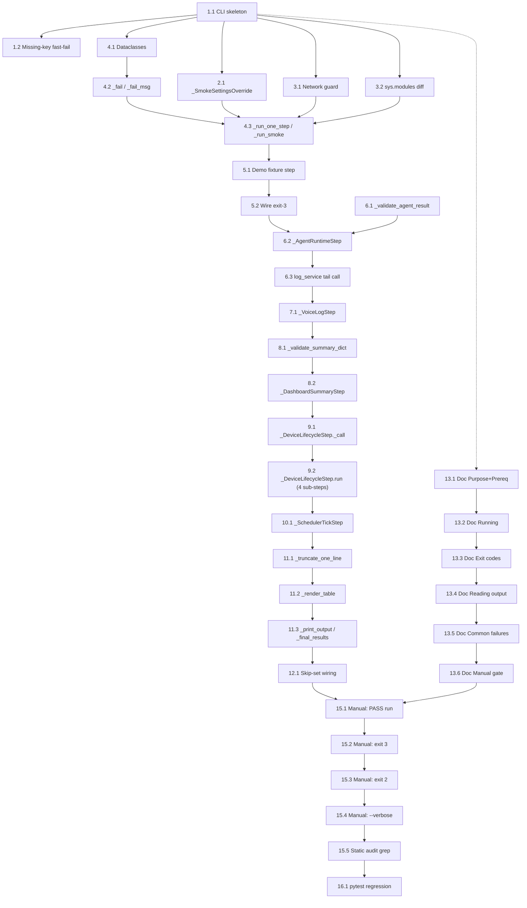

# Implementation Plan: Phase 8.5 Integration Smoke Test Backend

## Overview

Phase 8.5 men-deliver dua file baru saja:

1. `scripts/smoke_test_backend.py` — single-file CLI (~400 LOC) yang menjalankan enam Smoke Step berurutan terhadap DB dan komponen Phase 0–8 yang sudah ada.
2. `docs/SMOKE_TEST.md` — runbook-style usage doc.

Implementasi ini bersifat **strictly aditif**:

- Tidak ada perubahan pada `app/`, `agents/taskbot_agent/`, `app/migrations/`, atau `requirements.txt`.
- Tidak ada method service-layer baru, tidak ada schema baru, tidak ada migrasi baru, tidak ada endpoint HTTP baru.
- Tidak ada test pytest baru (`app/tests/test_smoke_flow.py` **tidak** ditambahkan — keputusan eksplisit di design §13).
- 186 test eksisting harus tetap lulus setelah Phase 8.5; itulah satu-satunya regression gate yang dijalankan terhadap suite pytest.

Konvensi:

- Bahasa implementasi: Python 3.14 (mengikuti stack Phase 0–8 yang sudah berjalan).
- Setiap leaf task melampirkan baik klausa Requirement yang diimplementasikan maupun Correctness Property yang divalidasi (tabel mapping kanonik ada di `design.md` §"Cross-Reference: Requirement → Property Map").
- Tidak ada sub-task tes property; properti Phase 8.5 sebagian besar adalah **commitment desain** atau **self-test** Smoke Run itu sendiri (lihat `design.md` §"Testing Strategy").
- Verifikasi "done" untuk tiap leaf task adalah ringan dan dapat diselesaikan dalam <30 menit. Audit grep, smoke run, atau import check sudah cukup.

## Tasks

- [x] 1. CLI scaffolding, argparse layout, dan missing-key fast-fail
  - [x] 1.1 Buat skeleton `scripts/smoke_test_backend.py`
    - Tambahkan shebang, module docstring (Bahasa Inggris), top-level imports `argparse`, `asyncio`, `concurrent.futures`, `socket`, `sys`, `traceback`, `textwrap`, `time`, dan import lazy `from app.config import settings`
    - Definisikan konstanta literal: `_USAGE_PROG = "python -m scripts.smoke_test_backend"`, `_EXIT_PASS = 0`, `_EXIT_FAIL = 1`, `_EXIT_MISSING_KEY = 2`, `_EXIT_MISSING_FIXTURE = 3`, `DEMO_USER_EMAIL = "demo@taskbot.local"`, `DEMO_DEVICE_CODE = "TASKBOT-DEMO-001"`
    - Implementasikan `_build_parser()` dengan flag `--real-agent` (action `store_true`) dan `--verbose` (action `store_true`)
    - Implementasikan `main(argv: list[str] | None = None) -> int` yang memanggil `_build_parser().parse_args(argv)`, menentukan `target_mode = "real" if args.real_agent else "fake"`, lalu memanggil `_run_smoke(target_mode=target_mode, verbose=args.verbose)` (stub dulu — return `_EXIT_PASS`)
    - Tambahkan blok `if __name__ == "__main__": raise SystemExit(main())`
    - Done: `python -m scripts.smoke_test_backend --help` mencetak usage tanpa error; `python -c "import scripts.smoke_test_backend"` selesai tanpa ImportError
    - _Requirements: 11.4, 11.5, 11.8_
    - _Properties: Property 13 (no HTTP-client imports at module level)_

  - [x] 1.2 Implementasikan helper `_gemini_key_is_set` dan missing-key fast-fail
    - Tambahkan fungsi `_gemini_key_is_set(value: str | None) -> bool` yang return `False` jika `value is None`, `value == ""`, atau `value.strip() == ""`; True selain itu
    - Di `main()`, **sebelum** memanggil `_run_smoke`, jika `args.real_agent and not _gemini_key_is_set(settings.google_api_key)`: print satu baris ke stderr (`"GOOGLE_API_KEY is required for --real-agent. Set it in the project-root .env and rerun, or omit --real-agent."`), return `_EXIT_MISSING_KEY` tanpa membuka DB session, tanpa memanggil `_run_smoke`, dan tanpa traceback
    - Done: jalankan `python -m scripts.smoke_test_backend --real-agent` di shell di mana `.env` mengosongkan `GOOGLE_API_KEY`; verifikasi exit code 2 dan tidak ada Python traceback
    - _Requirements: 2.1, 2.2, 2.3_
    - _Properties: Property 5_

- [x] 2. `_SmokeSettingsOverride` context manager (Req 1)
  - [x] 2.1 Implementasikan context manager dan exception
    - Definisikan `class _SmokeOverrideError(Exception): ...`
    - Definisikan `class _SmokeSettingsOverride` dengan `__init__(self, target_mode)` (assert `target_mode in ("fake", "real")`), `__enter__` yang menyimpan `self._previous_mode = settings.agent_mode` lalu menyetel `settings.agent_mode = self._target_mode` (raise `_SmokeOverrideError` saat penugasan gagal), dan `__exit__` yang memulihkan `settings.agent_mode = self._previous_mode` jika `self._applied`
    - Tidak boleh ada panggilan `open(".env"`, `Path(".env").write_text`, atau `dotenv.set_key` di mana pun di file
    - Done: import unit test ad-hoc di REPL — `with _SmokeSettingsOverride("fake"): assert settings.agent_mode == "fake"` dan setelah keluar `assert settings.agent_mode == <pre value>`
    - _Requirements: 1.1, 1.2, 1.3, 1.4, 1.6_
    - _Properties: Property 1, Property 2, Property 3, Property 4_

- [ ] 3. `_NetworkHermeticityGuard` (Req 9)
  - [x] 3.1 Implementasikan socket monkeypatch dan allowlist
    - Definisikan `class _NetworkHermeticityViolation(RuntimeError)` dan konstanta `_LOOPBACK_HOSTS = frozenset({"127.0.0.1", "::1", "localhost", "0.0.0.0"})` dan `_GEMINI_HOST_SUFFIXES = ("generativelanguage.googleapis.com", "oauth2.googleapis.com", "accounts.google.com")`
    - Implementasikan `class _NetworkHermeticityGuard` dengan `__init__(self, *, allow_gemini: bool)`, `install()` yang menyimpan original `socket.socket.connect`, `socket.socket.connect_ex`, `socket.create_connection`, `socket.getaddrinfo` ke `self._originals` dan memasang wrapper yang memeriksa allowlist via `_is_allowed`, dan `uninstall()` yang memulihkan dari `self._originals`
    - Wrapper raise `_NetworkHermeticityViolation(repr(address))` saat alamat tujuan di luar allowlist; allowlist loopback selalu aktif, allowlist Gemini hanya bila `self._allow_gemini`
    - Tidak boleh import `app.tests.conftest` atau memakai `pytest`/`monkeypatch` fixture mana pun
    - Done: ad-hoc REPL test — install guard dengan `allow_gemini=False`, panggil `socket.create_connection(("example.com", 80))`, harus raise `_NetworkHermeticityViolation`; lalu uninstall dan verifikasi `socket.create_connection` kembali ke original
    - _Requirements: 9.2, 9.3, 9.5_
    - _Properties: Property 17, Property 18_

  - [ ] 3.2 Implementasikan sys.modules snapshot/diff helper
    - Tambahkan helper `_diff_google_modules(pre: frozenset[str], post: frozenset[str]) -> set[str]` yang mengembalikan `{name for name in (post - pre) if re.match(r"^google\.(adk|genai)(\.|$)|^google_adk(\.|$)", name)}`
    - Done: ad-hoc REPL test — `_diff_google_modules(frozenset({"foo"}), frozenset({"foo", "google.adk", "google.genai.types", "bar"})) == {"google.adk", "google.genai.types"}`
    - _Requirements: 9.1_
    - _Properties: Property 17_

- [ ] 4. SmokeStep / SmokeContext / SmokeStepResult dataclasses, helper exception, dan dispatcher
  - [ ] 4.1 Definisikan dataclasses dan SmokeStep base class
    - Tambahkan `@dataclass class SmokeStepResult(name: str, status: str, error_message: str | None = None, error_traceback: str | None = None)`
    - Tambahkan `@dataclass class SmokeContext(db, user_id: str | None = None, device_id: str | None = None, agent_result = None, queued_command_id: str | None = None, target_mode: str = "fake", skip_after: set[str] = field(default_factory=set))`
    - Tambahkan `class SmokeStep` dengan attribute `name: str` dan method placeholder `def run(self, ctx: SmokeContext) -> SmokeStepResult: raise NotImplementedError`
    - Done: import file selesai tanpa error; `SmokeStepResult(name="x", status="PASS").status == "PASS"`
    - _Requirements: 10.1_
    - _Properties: Property 20_

  - [ ] 4.2 Implementasikan `_fail` dan `_fail_msg` helper
    - `_fail(step_name, exc, *, msg=None) -> SmokeStepResult` mengisi `error_message = msg or f"{type(exc).__name__}: {exc}"` dan `error_traceback = "".join(traceback.format_exception(type(exc), exc, exc.__traceback__))`
    - `_fail_msg(step_name, msg) -> SmokeStepResult` mengisi `error_message = msg` dan `error_traceback = None`
    - Tidak boleh memanggil `traceback.print_exc()` (akan dicetak hanya bila `--verbose`, oleh formatter)
    - Done: `_fail("x", RuntimeError("boom")).error_traceback` bukan kosong; `_fail_msg("y", "bad").error_traceback is None`
    - _Requirements: 10.3, 10.5, 10.6_
    - _Properties: Property 20_

  - [ ] 4.3 Implementasikan dispatcher `_run_one_step` dan `_run_smoke`
    - `_run_one_step(step, ctx)` membungkus `step.run(ctx)` di try/except: tangkap `_NetworkHermeticityViolation` → `_fail(step.name, exc, msg=f"network hermeticity violated: {exc}")`; tangkap `Exception` → `_fail(step.name, exc)`; selain itu return hasil step apa adanya
    - `_run_smoke(*, target_mode, verbose)`:
      - `pre_modules = frozenset(sys.modules)`
      - try blok luar untuk membuka `_SmokeSettingsOverride`; jika gagal masukkan baris "Settings Override" FAIL ke `extra_rows` dan lanjutkan
      - install `_NetworkHermeticityGuard(allow_gemini=(target_mode == "real"))`
      - buka `db = SessionLocal()` tepat satu kali
      - bangun `ctx = SmokeContext(db=db, target_mode=target_mode)` dan list 6 step (placeholder; class akan diisi di task 5–10)
      - loop step: jika `step.name in ctx.skip_after` → append baris SKIP dengan `error_message="skipped due to upstream failure"`; selain itu append `_run_one_step(step, ctx)`
      - finally: `guard.uninstall()`, exit `_SmokeSettingsOverride`, `db.close()`
      - return `_print_output(_final_results(extra_rows, results), verbose=verbose)` (stub `_print_output`/`_final_results` jika belum ada)
    - Done: `python -m scripts.smoke_test_backend` tetap selesai tanpa exception (steps masih kosong → tabel kosong adalah behavior sementara)
    - _Requirements: 1.7, 2.4, 3.1, 9.5, 10.7_
    - _Properties: Property 6, Property 7, Property 21_

- [ ] 5. Step 1 — Demo Fixture Lookup (Req 3)
  - [ ] 5.1 Implementasikan `_DemoFixtureMissing` dan `_DemoFixtureLookupStep`
    - Tambahkan `class _DemoFixtureMissing(Exception)` yang menerima `missing: list[str]` di `__init__` dan menyimpannya
    - Implementasikan `class _DemoFixtureLookupStep(SmokeStep)` dengan `name = "Demo Fixture Lookup"` dan `run(ctx)` yang melakukan dua query inline ORM: `db.query(User).filter(User.email == DEMO_USER_EMAIL).all()` dan `db.query(Device).filter(Device.device_code == DEMO_DEVICE_CODE).all()`
    - Sukses iff masing-masing list panjangnya tepat 1; jika tidak, kumpulkan `f"User(email={DEMO_USER_EMAIL!r}) count={len(users)}"` / `f"Device(device_code={DEMO_DEVICE_CODE!r}) count={len(devices)}"` ke `missing` dan raise `_DemoFixtureMissing(missing)`
    - Pada sukses, set `ctx.user_id = users[0].id`, `ctx.device_id = devices[0].id`, dan return `SmokeStepResult(name=self.name, status="PASS")`
    - Tidak boleh menambah method baru di `app/services/user_service.py` atau modul service lain; gap ORM-inline didokumentasikan di `design.md` §"Database-Read Gap Audit"
    - Done: import file selesai; class dapat di-instantiate
    - _Requirements: 3.2, 3.3, 12.4, 12.5_
    - _Properties: Property 7, Property 22_

  - [ ] 5.2 Wire `_DemoFixtureMissing` ke exit-3 path di `_run_smoke`
    - Tangkap `_DemoFixtureMissing` di sekitar loop step di `_run_smoke`; ekstrak `exc.missing`; cetak ke stderr satu baris yang menyebut tiap entri `missing`, plus literal `"python -m alembic upgrade head"` dan `"python -m scripts.seed_dev"`, mis. `print(f"Demo Fixture missing: {', '.join(exc.missing)}. Run: python -m alembic upgrade head; python -m scripts.seed_dev", file=sys.stderr)`
    - Setelah pesan stderr, return `_EXIT_MISSING_FIXTURE`; **tidak** mencetak tabel ringkasan; **tidak** menjalankan step Req 4–8 lain
    - Pastikan `db.close()` tetap dipanggil di blok `finally` outer
    - Done: jalankan smoke run dengan DB yang `User(email="demo@taskbot.local")` dihapus; verifikasi exit code 3 dan kedua literal command muncul di stderr
    - _Requirements: 3.4, 3.5_
    - _Properties: Property 8_

- [ ] 6. Step 2 — Agent Runtime fake mode (Req 4) + log tail (Req 5 prereq)
  - [ ] 6.1 Implementasikan `_validate_agent_result`
    - Fungsi `_validate_agent_result(result) -> tuple[bool, str | None]` melakukan pemeriksaan konjungtif: `result.status == "success"`; `isinstance(result.reply, str)` dan `1 <= len(result.reply.strip()) <= 10_000`; `isinstance(result.actions, list)` dan `1 <= len(result.actions) <= 50`; setiap elemen `actions` adalah `dict` yang punya key `"success"` dan `"type"`; minimal satu entri dengan `type == "expense"` dan `success is True`
    - Saat gagal, kembalikan `(False, "<one-line reason>")` yang menyebutkan field yang gagal dan observed value
    - Done: ad-hoc REPL — passing record `{"status":"success","reply":"ok","actions":[{"success":True,"type":"expense"}]}` (sebagai stub object) → `(True, None)`; passing record dengan `actions=[]` → `(False, ...)`
    - _Requirements: 4.3, 4.4, 4.5, 4.6_
    - _Properties: Property 9_

  - [ ] 6.2 Implementasikan `_AgentRuntimeStep` dengan asyncio.wait_for 30s
    - `class _AgentRuntimeStep(SmokeStep)` dengan `name = "Agent Runtime (fake)"`
    - Konstanta `_AGENT_TEXT = "catat makan siang 20000"`, `_AGENT_TIMEOUT_SECONDS = 30`
    - Di `run(ctx)`: import `from app.agent.runtime import run_text`; panggil `result = asyncio.run(asyncio.wait_for(run_text(ctx.db, user_id=ctx.user_id, device_id=ctx.device_id, text=_AGENT_TEXT, timezone=settings.timezone), timeout=_AGENT_TIMEOUT_SECONDS))` di dalam try/except Exception (termasuk `asyncio.TimeoutError`)
    - Pada exception/timeout: `ctx.skip_after.update({"VoiceCommandLog Persistence", "Dashboard Summary Read-Back"})` dan return `_fail(self.name, exc)`
    - Pada sukses: panggil `_validate_agent_result`; jika gagal, set `ctx.skip_after` sama dan return `SmokeStepResult(FAIL, ...)`
    - Done: import file; class instantiable; saat dipanggil ulang dengan ctx valid pada DB seeded, return `SmokeStepResult(status="PASS")`
    - _Requirements: 4.1, 4.2, 4.7, 4.8_
    - _Properties: Property 9, Property 10_

  - [ ] 6.3 Tail-call `log_service.create_voice_command_log` setelah validasi
    - Setelah `_validate_agent_result` lulus dan **sebelum** mengembalikan PASS, panggil `log_service.create_voice_command_log(ctx.db, user_id=ctx.user_id, device_id=ctx.device_id, input_text=_AGENT_TEXT, parsed_actions=result.actions, response_text=result.reply, status=result.status)`
    - Set `ctx.agent_result = result` lalu return `SmokeStepResult(name=self.name, status="PASS")`
    - Tidak boleh menambah method baru di `app/services/log_service.py`
    - Done: setelah smoke run sukses, query ad-hoc `db.query(VoiceCommandLog).filter(VoiceCommandLog.input_text == "catat makan siang 20000").count() >= 1`
    - _Requirements: 4.7, 12.4_
    - _Properties: Property 11, Property 22_

- [ ] 7. Step 3 — VoiceCommandLog Persistence (Req 5)
  - [ ] 7.1 Implementasikan `_VoiceLogStep`
    - `class _VoiceLogStep(SmokeStep)` dengan `name = "VoiceCommandLog Persistence"`
    - Di `run(ctx)`: import `from app.models.voice_command_log import VoiceCommandLog`; query inline ORM dengan tepat tiga filter `(user_id == ctx.user_id, input_text == _AGENT_TEXT, status == "success")` dan `.all()`
    - PASS jika `len(rows) >= 1`; selain itu return `_fail_msg(self.name, f"VoiceCommandLog query matched {len(rows)} rows for user_id={ctx.user_id!r}, input_text={_AGENT_TEXT!r}, status='success'")`
    - Tidak boleh memanggil method `log_service.list_*` baru; gap ORM-inline didokumentasikan di `design.md` §"Database-Read Gap Audit"
    - Done: smoke run setelah step 2 PASS → step 3 PASS
    - _Requirements: 5.1, 5.2, 5.3, 12.4, 12.5_
    - _Properties: Property 11, Property 22_

- [ ] 8. Step 4 — Dashboard Summary Read-Back (Req 6) dengan ThreadPoolExecutor 5s ceiling
  - [ ] 8.1 Implementasikan `_validate_summary_dict`
    - Fungsi `_validate_summary_dict(result, *, name) -> SmokeStepResult` melakukan pemeriksaan: `isinstance(result, dict)`; `result.get("success") is True`; `result.get("type") == "summary"`; `total = result.get("total_expenses_today")` adalah `int` ketat (`isinstance(total, bool)` → FAIL) dan `20_000 <= total <= 2_147_483_647`
    - Error message menyebut field yang gagal dan observed value (mis. `f"summary['type'] != 'summary' (got {result.get('type')!r})"`)
    - Done: ad-hoc — `_validate_summary_dict({"success": True, "type": "summary", "total_expenses_today": 20000}, name="x").status == "PASS"`; `_validate_summary_dict({"success": True, "type": "summary", "total_expenses_today": True}, name="x").status == "FAIL"` (tolak `bool`)
    - _Requirements: 6.2, 6.3, 6.4, 6.7_
    - _Properties: Property 12_

  - [ ] 8.2 Implementasikan `_DashboardSummaryStep`
    - `class _DashboardSummaryStep(SmokeStep)` dengan `name = "Dashboard Summary Read-Back"` dan konstanta `_SUMMARY_TIMEOUT_SECONDS = 5`
    - Di `run(ctx)`: import `from app.tools.summary_tools import get_today_summary_tool`; panggil di dalam `concurrent.futures.ThreadPoolExecutor(max_workers=1)` via `ex.submit(get_today_summary_tool, ctx.db, ctx.user_id).result(timeout=_SUMMARY_TIMEOUT_SECONDS)`
    - Pada `concurrent.futures.TimeoutError` → return `_fail(self.name, exc, msg=f"get_today_summary_tool exceeded {_SUMMARY_TIMEOUT_SECONDS}s ceiling")` (tidak menjalankan validasi)
    - Pada `Exception` lain → `_fail(self.name, exc)`
    - Pada sukses → return `_validate_summary_dict(result, name=self.name)`
    - **Tidak** mengimport `httpx`, `requests`, `urllib.request`, `uvicorn`, atau `fastapi.testclient` di mana pun di file
    - Done: smoke run setelah step 2 PASS → step 4 PASS dengan `total_expenses_today >= 20_000`
    - _Requirements: 6.1, 6.5, 6.6, 6.7_
    - _Properties: Property 12, Property 13_

- [ ] 9. Step 5 — Device Command Lifecycle (Req 7) dengan Atomic Mark-Sent re-poll
  - [ ] 9.1 Implementasikan helper `_DeviceLifecycleStep._call` (5s per call)
    - Konstanta `_DEVICE_CALL_TIMEOUT_SECONDS = 5`, `_DEVICE_CMD_TYPE = "show_text"`, `_DEVICE_CMD_PAYLOAD = {"text": "smoke"}`
    - Definisikan `_call(self, label, fn, *args)` yang membungkus `ex.submit(fn, *args).result(timeout=_DEVICE_CALL_TIMEOUT_SECONDS)`; pada `concurrent.futures.TimeoutError` return `_fail(self.name, exc, msg=f"{label} exceeded {_DEVICE_CALL_TIMEOUT_SECONDS}s ceiling")`; pada `Exception` lain return `_fail(self.name, exc, msg=f"{label} raised: {exc!r}")`; pada `result is None` return `_fail_msg(self.name, f"{label} returned None")`; selain itu return result
    - Done: import file selesai; helper unit-callable
    - _Requirements: 7.6_
    - _Properties: Property 14_

  - [ ] 9.2 Implementasikan `_DeviceLifecycleStep.run` — empat sub-step PENDING→SENT→ACK + Atomic Mark-Sent re-poll
    - `class _DeviceLifecycleStep(SmokeStep)` dengan `name = "Device Command Lifecycle"`
    - **Sub-step 7.1**: `cmd = self._call("queue_device_command", device_service.queue_device_command, ctx.db, ctx.device_id, _DEVICE_CMD_TYPE, _DEVICE_CMD_PAYLOAD)`; verifikasi `isinstance(cmd.id, str) and cmd.id` dan `cmd.status == DeviceCommandStatus.PENDING`; simpan `ctx.queued_command_id = cmd.id`
    - **Sub-step 7.2**: `pending = self._call("list_pending_device_commands", device_service.list_pending_device_commands, ctx.db, DEMO_DEVICE_CODE)`; verifikasi `[p.id for p in pending].count(cmd.id) == 1`
    - **Sub-step 7.3**: `sent = self._call("mark_device_command_sent", device_service.mark_device_command_sent, ctx.db, cmd.id)`; verifikasi `sent.id == cmd.id and sent.status == DeviceCommandStatus.SENT`; **Atomic Mark-Sent re-poll**: `pending_after = self._call("list_pending_device_commands", device_service.list_pending_device_commands, ctx.db, DEMO_DEVICE_CODE)`; verifikasi `not any(p.id == cmd.id for p in pending_after)`
    - **Sub-step 7.4**: `acked = self._call("ack_device_command", device_service.ack_device_command, ctx.db, cmd.id)`; verifikasi `acked.id == cmd.id and acked.status == DeviceCommandStatus.ACKNOWLEDGED`
    - Setiap kegagalan verifikasi return `_fail_msg(self.name, f"7.X <assertion failure detail>")` agar `failure record SHALL identify which clause and which assertion failed`
    - Done: smoke run setelah step 1 PASS → step 5 PASS dengan baris `device_commands` baru bertransisi PENDING→SENT→ACKNOWLEDGED yang dapat diinspeksi di `taskbot.db`
    - _Requirements: 7.1, 7.2, 7.3, 7.4, 7.5, 7.6_
    - _Properties: Property 14_

- [ ] 10. Step 6 — Scheduler Tick (Req 8) tanpa instantiation APScheduler
  - [ ] 10.1 Implementasikan `_SchedulerTickStep` dengan 10s ceiling dan validasi shape
    - `class _SchedulerTickStep(SmokeStep)` dengan `name = "Scheduler Tick"` dan konstanta `_TICK_TIMEOUT_SECONDS = 10`
    - Di `run(ctx)`: import `from app.db import SessionLocal` dan `from app.scheduler.tick import reminder_tick`
    - Panggil di `ThreadPoolExecutor(max_workers=1)` via `ex.submit(reminder_tick, db_factory=SessionLocal).result(timeout=_TICK_TIMEOUT_SECONDS)`; tangkap `concurrent.futures.TimeoutError` dan `Exception` umum dengan `_fail` masing-masing menyertakan label `"reminder_tick exceeded {ceiling}s ceiling"` atau `f"reminder_tick raised: {exc!r}"`
    - Validasi shape: `isinstance(result, dict)` dan `set(result.keys()) == {"sent", "failed", "skipped"}` dan untuk setiap `k` di set: `not isinstance(result[k], bool) and isinstance(result[k], int) and result[k] >= 0`; setiap kegagalan validasi return `_fail_msg(self.name, "<which check> got <observed value/type>")`
    - **Tidak boleh** mengimport `apscheduler.schedulers.background.BackgroundScheduler`, `BlockingScheduler`, atau `AsyncIOScheduler` di file ini; tidak boleh memanggil `start_scheduler` dari `app.scheduler.lifecycle`
    - Done: smoke run → step 6 PASS dengan dict `{"sent": <int>, "failed": <int>, "skipped": <int>}` semua int non-negatif; `threading.enumerate()` setelah run tidak menunjukkan thread bernama prefix `APScheduler:`
    - _Requirements: 8.1, 8.2, 8.3, 8.4, 8.5_
    - _Properties: Property 15, Property 16_

- [ ] 11. Output formatter, truncation helper, dan exit-code dispatcher (Req 10)
  - [ ] 11.1 Implementasikan `_truncate_one_line`
    - Fungsi `_truncate_one_line(msg: str, *, limit: int = 200) -> str`: `one_line = " ".join(msg.split())`; jika `len(one_line) <= limit` return `one_line`; selain itu return `one_line[: limit - 1].rstrip() + "…"`
    - Done: `_truncate_one_line("a"*250)` panjangnya tepat 200 dan diakhiri `"…"`; `_truncate_one_line("hello\nworld")` == `"hello world"`
    - _Requirements: 10.3_
    - _Properties: Property 20_

  - [ ] 11.2 Implementasikan `_render_table`
    - Fungsi `_render_table(results: list[SmokeStepResult]) -> str` membangun header `f"{'Smoke Step':<{name_width}}  {'Result':<6}  Error"` (dengan `name_width = max(len(r.name) for r in results)`), pemisah `"-" * len(header)`, dan satu baris per result; baris FAIL menambahkan `_truncate_one_line(r.error_message, limit=200)` setelah kolom Result
    - Tidak boleh mencetak `error_traceback` di sini
    - Done: `_render_table([SmokeStepResult("X", "PASS"), SmokeStepResult("Y", "FAIL", error_message="bad")])` menghasilkan string multiline dengan baris FAIL berisi pesan
    - _Requirements: 10.1_
    - _Properties: Property 20_

  - [ ] 11.3 Implementasikan `_print_output`, `_final_results`, dan `_print_demo_fixture_missing`
    - `_final_results(extra_rows, results) -> list[SmokeStepResult]` mengembalikan baris dengan urutan: baris "Settings Override" FAIL (jika ada di `extra_rows`), lalu enam step Req 3–8 dalam urutan deklarasi, lalu baris "Network Hermeticity (post-run)" FAIL (jika ada di `extra_rows`)
    - `_print_output(results, *, verbose) -> int`: cetak `_render_table(results)` ke stdout; tentukan `any_fail = any(r.status == "FAIL" for r in results)`; bila any_fail → cetak `"SMOKE TEST: FAIL"` dan jika `verbose`: untuk tiap result FAIL dengan `error_traceback`, cetak ke stderr `f"\n--- traceback for {r.name} ---"` lalu `r.error_traceback`; return `_EXIT_FAIL`. Sebaliknya cetak `"SMOKE TEST: PASS"` dan return `_EXIT_PASS`
    - `_print_demo_fixture_missing(exc)` mencetak satu baris stderr dengan literal `python -m alembic upgrade head` dan `python -m scripts.seed_dev` (sudah dipasang di task 5.2; dipisahkan ke fungsi sendiri di sini agar dapat dipanggil dari `_run_smoke`)
    - Saat non-`--verbose`, **tidak** ada traceback yang dicetak ke stdout maupun stderr
    - Done: smoke run all-PASS → exit 0 + stdout berakhir `"SMOKE TEST: PASS"`; smoke run dengan satu FAIL → exit 1 + stdout berakhir `"SMOKE TEST: FAIL"` + tidak ada traceback (kecuali `--verbose`)
    - _Requirements: 10.1, 10.2, 10.3, 10.4, 10.5, 10.6, 10.7, 11.6_
    - _Properties: Property 20, Property 21_

- [ ] 12. Skip-set logic untuk upstream failure (Req 4.8)
  - [ ] 12.1 Verifikasi plumbing `ctx.skip_after` di `_run_smoke` dan label SKIP
    - Pastikan loop step di `_run_smoke` (task 4.3) memeriksa `step.name in ctx.skip_after` **sebelum** memanggil `_run_one_step`; bila true, append `SmokeStepResult(name=step.name, status="SKIP", error_message="skipped due to upstream failure")`
    - Pastikan `_AgentRuntimeStep` (task 6.2) mengisi `ctx.skip_after.update({"VoiceCommandLog Persistence", "Dashboard Summary Read-Back"})` di **kedua** path FAIL (exception/timeout dan validasi predikat)
    - Pastikan step 5 (`Device Command Lifecycle`) dan step 6 (`Scheduler Tick`) **tidak** masuk `skip_after` set saat step 2 gagal
    - Pastikan formatter (task 11.2) menampilkan `SKIP` sebagai status valid (selain `PASS`/`FAIL`)
    - Done: simulasi — patch sementara `_AgentRuntimeStep.run` agar selalu raise; jalankan smoke; verifikasi tabel menunjukkan baris 3,4 = SKIP dan baris 5,6 = PASS/FAIL (bukan SKIP); pulihkan patch
    - _Requirements: 4.8_
    - _Properties: Property 6, Property 10_

- [ ] 13. Tulis `docs/SMOKE_TEST.md` (Req 11) sesuai outline design.md §14
  - [x] 13.1 Tulis section "Purpose" dan "Prerequisites"
    - Heading `# Smoke Test (Phase 8.5)` di paling atas
    - Section "Purpose" satu paragraf: Phase 8.5 adalah manual gate sebelum Phase 9 frontend; bullet list kategori yang dilatih: database, Service Layer, Agent Runtime in fake mode, dashboard read path, device command queue, Reminder Scheduler tick
    - Section "Prerequisites" sebagai ordered list dengan dua item literal di code block urutan ini: (1) `python -m alembic upgrade head`, (2) `python -m scripts.seed_dev`
    - Bahasa dokumen: Bahasa Inggris (sesuai konvensi steering 01: docs di `docs/` adalah English)
    - Done: file dibuka, section Purpose dan Prerequisites lengkap dengan literal command yang exact-match
    - _Requirements: 11.1, 11.2, 11.3_

  - [x] 13.2 Tulis section "Running" dengan tiga sub-section
    - "Default (fake agent, hermetic)": `python -m scripts.smoke_test_backend` di code block
    - "With the real Gemini agent": `python -m scripts.smoke_test_backend --real-agent` di code block plus bullet list catatan (contacts the Gemini API; requires `GOOGLE_API_KEY` set in the project-root `.env`; may incur cost or quota usage)
    - "Verbose tracebacks": `python -m scripts.smoke_test_backend --verbose` di code block
    - Done: tiga sub-section ada, setiap literal command exact-match
    - _Requirements: 11.4, 11.5_

  - [x] 13.3 Tulis section "Exit codes" dengan tabel
    - Tabel markdown tiga kolom (Code, Meaning) dengan empat baris: `0 → PASS`, `1 → FAIL`, `2 → missing GOOGLE_API_KEY for --real-agent`, `3 → missing Demo Fixture`
    - Done: tabel valid markdown dengan 4 baris exit code
    - _Requirements: 11.6_

  - [ ] 13.4 Tulis section "Reading the output"
    - Contoh tabel PASS (semua step PASS) dalam blok kode
    - Contoh tabel FAIL dengan satu baris pesan exception ≤200 char dengan suffix `…` dalam blok kode
    - Catatan lokasi traceback lengkap: `--verbose` mencetak ke stderr; tanpa `--verbose` tidak ada traceback yang dicetak
    - Done: section memiliki dua blok kode tabel (PASS dan FAIL) plus paragraf lokasi traceback
    - _Requirements: 11.9_

  - [ ] 13.5 Tulis section "Common failures" dengan tabel ≥3 kolom dan ≥1 row per non-zero exit code
    - Kolom: `Symptom`, `Likely cause`, `Fix`
    - Minimal 5 baris (mengikuti tabel di design.md §14):
      - exit 3 + "Demo Fixture missing" → forgot to seed → `python -m alembic upgrade head; python -m scripts.seed_dev`
      - exit 2 + "GOOGLE_API_KEY required" → `--real-agent` without key → set key in project-root `.env` atau hilangkan flag
      - FAIL "Agent Runtime (fake)" + asyncio.TimeoutError → DB locked/`taskbot.db` open elsewhere → close other connections, retry
      - FAIL "Network Hermeticity (post-run)" → some module imported `google.adk` in fake mode → grep recently changed code for unconditional `google.adk` imports
      - FAIL "Scheduler Tick" + TypeError → `reminder_tick` return shape changed → check `app/scheduler/tick.py` returns `{"sent","failed","skipped"}` of ints
    - Style mengikuti `.kiro/steering/03-runbook.md` "Common failures & fixes"
    - Done: tabel valid markdown dengan ≥5 baris dan tepat tiga kolom
    - _Requirements: 11.7_

  - [ ] 13.6 Tulis section "Manual gate disclaimer"
    - Satu paragraf eksplisit menyatakan Smoke Test Backend adalah manual gate dan **tidak** terhubung ke pipeline CI mana pun
    - Done: section ada di akhir dokumen
    - _Requirements: 11.8_

- [ ] 14. Checkpoint — script importable dan dokumen lengkap
  - Pastikan `python -c "import scripts.smoke_test_backend"` selesai tanpa error.
  - Pastikan `python -m scripts.smoke_test_backend --help` mencetak usage Bahasa Inggris dengan kedua flag (`--real-agent`, `--verbose`).
  - Pastikan `docs/SMOKE_TEST.md` selesai dengan ke-9 klausa Req 11 ter-cover (Purpose, Prerequisites, Running default, Running --real-agent, Exit codes, Reading the output, Common failures, Manual gate disclaimer; verifikasi via grep terhadap literal command dan exit code 2/3).
  - Ensure all tests pass, ask the user if questions arise.

- [ ] 15. Manual verification run plan — self-test properti kritikal (Req 9, Req 10, sebagian Req 1–8)
  - [ ] 15.1 Jalankan smoke run default mode terhadap DB yang sudah di-seed → PASS exit 0
    - Prerequisites: pastikan `python -m alembic upgrade head` sudah dijalankan dan `python -m scripts.seed_dev` sudah membuat `User(email="demo@taskbot.local")` dan `Device(device_code="TASKBOT-DEMO-001")`
    - Jalankan `python -m scripts.smoke_test_backend`
    - Verifikasi: `echo %ERRORLEVEL%` (cmd) atau `$LASTEXITCODE` (PowerShell) == `0`; stdout berakhir `"SMOKE TEST: PASS"`; tabel berisi 6 baris dengan status PASS untuk Demo Fixture Lookup, Agent Runtime (fake), VoiceCommandLog Persistence, Dashboard Summary Read-Back, Device Command Lifecycle, Scheduler Tick
    - Done: ditandai PASS exit 0 di terminal
    - _Requirements: 4.1, 5.1, 6.1, 7.1, 8.1, 10.1, 10.2_
    - _Properties: Property 9, Property 11, Property 12, Property 14, Property 15, Property 17, Property 20_

  - [ ] 15.2 Jalankan smoke run dengan Demo Fixture hilang → exit 3 (Property 8 self-test)
    - Hapus baris Demo User via sqlite CLI: `python -c "import sqlite3; conn = sqlite3.connect('taskbot.db'); conn.execute(\"DELETE FROM users WHERE email='demo@taskbot.local'\"); conn.commit(); conn.close()"`
    - Jalankan `python -m scripts.smoke_test_backend`
    - Verifikasi: exit code `3`; stderr mengandung `User(email='demo@taskbot.local')` dan kedua literal `python -m alembic upgrade head` serta `python -m scripts.seed_dev`; **tidak** ada tabel ringkasan; **tidak** ada traceback Python
    - Pulihkan: jalankan ulang `python -m scripts.seed_dev`
    - Done: exit 3 verified; Demo Fixture dipulihkan
    - _Requirements: 3.4, 3.5_
    - _Properties: Property 8_

  - [ ] 15.3 Jalankan `--real-agent` dengan `GOOGLE_API_KEY` kosong → exit 2 (Property 5 self-test)
    - Sementara kosongkan `GOOGLE_API_KEY` di `.env` (back up dengan `copy .env .env.bak`, lalu replace dengan `set "" =""`); **jangan** commit perubahan ini
    - Jalankan `python -m scripts.smoke_test_backend --real-agent`
    - Verifikasi: exit code `2`; stderr berisi pesan satu baris yang menyebut `GOOGLE_API_KEY` dan `--real-agent`; **tidak** ada traceback; tidak ada baris dari Smoke Step yang dicetak (tabel tidak muncul)
    - Pulihkan: `move /Y .env.bak .env`
    - Done: exit 2 verified; `.env` dipulihkan
    - _Requirements: 2.1, 2.2, 2.3_
    - _Properties: Property 5_

  - [ ] 15.4 Inject step failure dan verifikasi `--verbose` mencetak traceback ke stderr (Property 20 self-test)
    - Sementara ubah `_AGENT_TEXT = "catat makan siang 20000"` di `scripts/smoke_test_backend.py` menjadi nilai yang fake agent tidak bisa parse, mis. `_AGENT_TEXT = "lkasdjf qweoir"` (Fake Agent akan return `actions=[]`, gagal validasi)
    - Jalankan `python -m scripts.smoke_test_backend --verbose`
    - Verifikasi: exit code `1`; stdout berakhir `"SMOKE TEST: FAIL"` dengan baris "Agent Runtime (fake)" FAIL; stderr berisi traceback `--- traceback for Agent Runtime (fake) ---` (atau mirip); baris VoiceCommandLog Persistence dan Dashboard Summary Read-Back menunjukkan SKIP; baris Device Command Lifecycle dan Scheduler Tick tetap dieksekusi
    - Lalu jalankan tanpa `--verbose`: verifikasi exit `1` dan stderr **tidak** berisi traceback
    - Pulihkan: kembalikan `_AGENT_TEXT` ke literal aslinya
    - Done: kedua run verified; literal `_AGENT_TEXT` dipulihkan
    - _Requirements: 4.8, 10.3, 10.4, 10.5, 10.6_
    - _Properties: Property 6, Property 10, Property 20_

  - [ ] 15.5 Static audit grep — Property 3, 13, 16, 19, 21, 22 commitment
    - Jalankan grep di `scripts/smoke_test_backend.py` (semua harus zero match):
      - `open("\\.env"` — Property 3 (no `.env` write)
      - `import httpx|import requests|import urllib\\.request|fastapi\\.testclient|uvicorn|hypercorn|daphne` — Property 13
      - `BackgroundScheduler|BlockingScheduler|AsyncIOScheduler|app\\.scheduler\\.lifecycle` — Property 16
      - `db\\.delete\\(|db\\.rollback\\(|DELETE FROM` — Property 21
    - Jalankan grep di `git diff --stat` (atau `git status`) untuk konfirmasi hanya dua file baru muncul: `scripts/smoke_test_backend.py` dan `docs/SMOKE_TEST.md`; tidak ada perubahan di `app/`, `agents/taskbot_agent/`, `app/migrations/`, `requirements.txt`, atau frontend (Property 22)
    - Jalankan grep di `app/integrations/whatsapp.py` (zero match): `import httpx|import requests|import urllib` — Property 19 (struktural; modul Phase 6 yang ada)
    - Done: setiap pattern di atas zero match (atau patch diff hanya menyentuh dua file expected)
    - _Requirements: 1.3, 6.5, 8.4, 10.7, 12.3, 12.4, 12.6, 12.7, 12.8_
    - _Properties: Property 3, Property 13, Property 16, Property 19, Property 21, Property 22_

- [ ] 16. Final regression — pastikan 186 test eksisting tetap lulus (Property 22)
  - [ ] 16.1 Jalankan `python -m pytest -q` dan verifikasi 186/186 pass
    - Dari project root, jalankan `python -m pytest -q`
    - Verifikasi: ringkasan akhir menunjukkan `186 passed` (atau jumlah yang sama dengan baseline Phase 8) dan tidak ada test baru yang ditambahkan oleh Phase 8.5
    - Verifikasi: `git diff --stat -- app/tests/` kosong (tidak ada modifikasi atau penambahan file di `app/tests/`)
    - Done: 186 passed; `app/tests/` tidak berubah
    - _Requirements: 12.3, 12.4, 12.7, 12.8_
    - _Properties: Property 22_

## Definition of Done — Phase 8.5 PR Review Checklist

Checklist berikut **harus** terverifikasi semua sebelum Phase 8.5 di-merge. Cermin §"Manual Run Plan" di `design.md` plus konstrain aditif Phase 8.5. Ini bukan workflow task; ini adalah ringkasan reviewer-facing yang dipakai saat PR review setelah task 1–16 selesai.

- ☐ **Deliverables**: hanya dua file baru — `scripts/smoke_test_backend.py` dan `docs/SMOKE_TEST.md`. Tidak ada modifikasi di `app/`, `agents/taskbot_agent/`, `app/migrations/`, `requirements.txt`, atau folder frontend (Property 22).
- ☐ **No new pytest test**: `app/tests/test_smoke_flow.py` **tidak** dibuat (keputusan eksplisit di `design.md` §13). `app/tests/conftest.py` tidak diubah. Tidak ada hook pre-commit / CI workflow baru yang memanggil Smoke Run.
- ☐ **No new service method**: `app/services/*.py` tidak menambah fungsi top-level baru; gap query (lookup-user-by-email, list-voice-logs-by-user) didokumentasikan di `design.md` §"Database-Read Gap Audit" dan diisi via inline ORM query di skrip (Req 12.4, 12.5).
- ☐ **Manual run #1**: `python -m scripts.smoke_test_backend` → exit 0, "SMOKE TEST: PASS", 6 baris PASS (task 15.1).
- ☐ **Manual run #2**: smoke run dengan Demo Fixture hilang → exit 3, stderr berisi `python -m alembic upgrade head` dan `python -m scripts.seed_dev`, tidak ada tabel ringkasan, tidak ada traceback (task 15.2 / Property 8).
- ☐ **Manual run #3**: `python -m scripts.smoke_test_backend --real-agent` dengan `GOOGLE_API_KEY` kosong → exit 2, stderr satu baris, tidak ada traceback (task 15.3 / Property 5).
- ☐ **Manual run #4**: smoke run dengan injected failure di step 2 + `--verbose` → exit 1, stdout berakhir "SMOKE TEST: FAIL", stderr memuat traceback; tanpa `--verbose` → tidak ada traceback (task 15.4 / Property 20).
- ☐ **Manual run #5 (opsional, butuh `GOOGLE_API_KEY` valid)**: `python -m scripts.smoke_test_backend --real-agent` → PASS, dan tidak ada outbound traffic ke domain non-Gemini (Property 18).
- ☐ **Static audit grep**: zero match untuk pattern Property 3, 13, 16, 19, 21 (task 15.5).
- ☐ **Pytest regression**: `python -m pytest -q` melaporkan 186 passed (task 16.1 / Property 22).
- ☐ **Documentation review**: `docs/SMOKE_TEST.md` punya kesembilan section Req 11 (Purpose, Prerequisites, Running default, Running --real-agent, Reading the output, Exit codes, Common failures, Manual gate disclaimer); tabel exit code memetakan 0/1/2/3 tepat; tabel "Common failures" punya tepat tiga kolom (Symptom, Likely cause, Fix) dan ≥1 baris per non-zero exit code.

## Notes

- Phase 8.5 adalah **manual gate**. Tidak ada test pytest baru yang ditambahkan; verifikasi dilakukan via Manual Run Plan (task 15) dan static audit grep (task 15.5). 186 test eksisting tetap satu-satunya regression gate yang dijalankan terhadap suite pytest (task 16.1, Property 22).
- Setiap leaf task ditujukan untuk diselesaikan dalam <30 menit. Task yang lebih besar (mis. step 5 device lifecycle) sengaja dipecah ke `_call` helper plus implementasi `run` agar masing-masing tetap kecil.
- "Done criterion" untuk tiap task adalah verifikasi ringan: import check, ad-hoc REPL call, exit code observation, atau grep pattern. Tidak diharuskan menulis test pytest baru.
- Tidak ada checkpoint berbasis-pytest di tengah Phase 8.5 (selain task 14 dan 16.1) karena suite pytest tidak menyentuh `scripts/smoke_test_backend.py` — Smoke Test Backend adalah CLI gate manual, bukan modul library.
- Tabel mapping Req → Property kanonik ada di `design.md` §"Cross-Reference: Requirement → Property Map"; tiap leaf task di file ini hanya mengulangi properti yang relevan dengan task itu sendiri. Properti dengan mode "(commit)" (mis. Property 3, 13, 16, 19, 21, 22) ditegakkan via static audit grep di task 15.5; properti "(self-test)" ditegakkan oleh setiap manual run di task 15.1–15.4 dan setiap pemanggilan Smoke Run berikutnya.

## Task Dependency Graph



```json
{
  "waves": [
    { "id": 0, "tasks": ["1.1"] },
    { "id": 1, "tasks": ["1.2", "13.1"] },
    { "id": 2, "tasks": ["2.1", "13.2"] },
    { "id": 3, "tasks": ["3.1", "13.3"] },
    { "id": 4, "tasks": ["3.2", "13.4"] },
    { "id": 5, "tasks": ["4.1", "13.5"] },
    { "id": 6, "tasks": ["4.2", "13.6"] },
    { "id": 7, "tasks": ["4.3"] },
    { "id": 8, "tasks": ["5.1"] },
    { "id": 9, "tasks": ["5.2"] },
    { "id": 10, "tasks": ["6.1"] },
    { "id": 11, "tasks": ["6.2"] },
    { "id": 12, "tasks": ["6.3"] },
    { "id": 13, "tasks": ["7.1"] },
    { "id": 14, "tasks": ["8.1"] },
    { "id": 15, "tasks": ["8.2"] },
    { "id": 16, "tasks": ["9.1"] },
    { "id": 17, "tasks": ["9.2"] },
    { "id": 18, "tasks": ["10.1"] },
    { "id": 19, "tasks": ["11.1"] },
    { "id": 20, "tasks": ["11.2"] },
    { "id": 21, "tasks": ["11.3"] },
    { "id": 22, "tasks": ["12.1"] },
    { "id": 23, "tasks": ["15.1"] },
    { "id": 24, "tasks": ["15.2"] },
    { "id": 25, "tasks": ["15.3"] },
    { "id": 26, "tasks": ["15.4"] },
    { "id": 27, "tasks": ["15.5"] },
    { "id": 28, "tasks": ["16.1"] }
  ]
}
```
