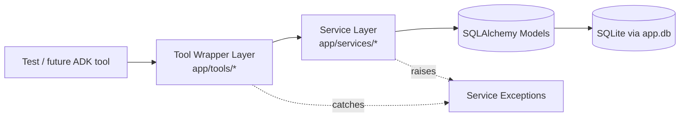
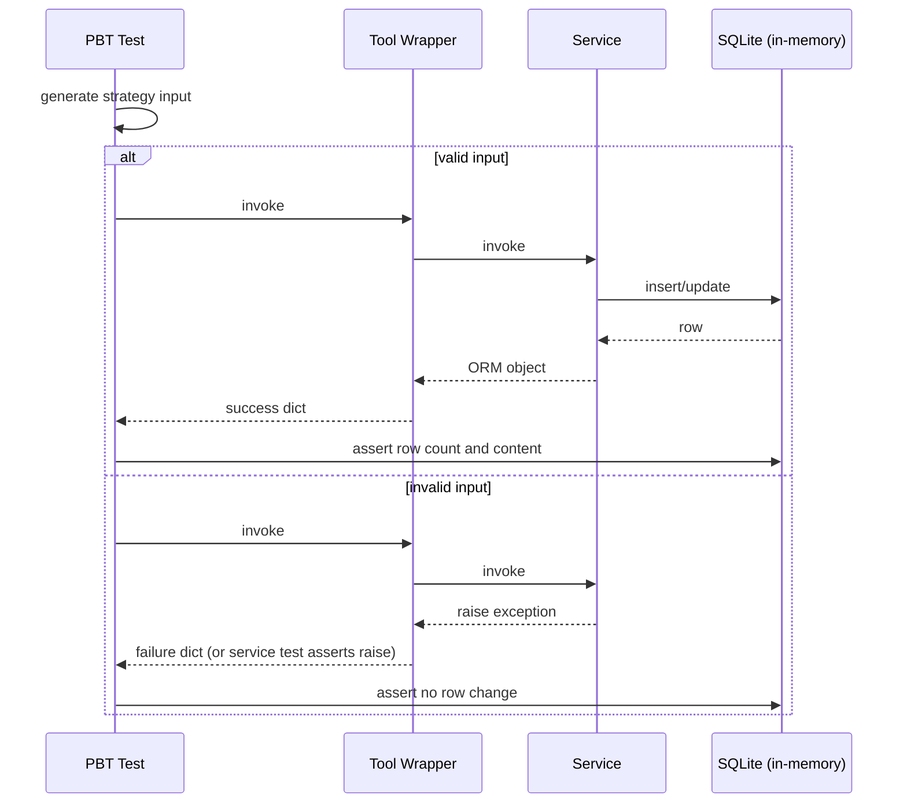

# Design Document — Service Layer (Phase 3)

## Overview

Phase 3 menambahkan dua layer baru di atas data layer Phase 2:

1. **Service Layer** (`app/services/`): business logic murni. Setiap service menerima `Session` SQLAlchemy dan parameter primitif/Python objects, melakukan validasi, memanipulasi ORM, dan mengembalikan ORM object atau dict ringan. Tidak ada dependency pada FastAPI, Google ADK, atau framework AI.
2. **Tool Wrapper Layer** (`app/tools/`): plain Python function yang membungkus pemanggilan service dan menormalisasi hasil/error menjadi *Tool Result Dict* yang ramah agent. Layer ini adalah seam yang akan dibungkus ulang sebagai Google ADK tools di Phase 4 tanpa mengubah service layer.

Tujuan desain: business logic dapat diuji tanpa AI, validasi terkonsentrasi di satu layer, dan integrasi ADK kelak hanya menambah adapter.

### Prinsip Pemisahan Layer

| Layer | Tahu tentang | Tidak boleh tahu tentang |
|---|---|---|
| Models | DB schema | Bisnis, HTTP, agent |
| Services | Bisnis, ORM, validasi | HTTP, agent, cara pemformatan untuk LLM |
| Tool Wrappers | Bentuk output yang LLM-friendly | ADK SDK (di Phase 3), HTTP |
| API (existing) | HTTP | Bentuk output untuk LLM |
| Agent (Phase 4+) | ADK SDK | ORM langsung |

Service tidak pernah mengembalikan dict yang ditujukan untuk LLM. Tool wrapper tidak pernah mengakses ORM langsung — selalu lewat service.

## Architecture

### Komponen dan Aliran Data



Tool wrapper memanggil service. Bila service melempar `ValidationError`, `NotFoundError`, atau `PermissionDeniedError`, tool wrapper menangkap dan mengubahnya menjadi `{"success": False, "error": str(e), "type": ...}`. Pengecualian lain (mis. `IntegrityError`) tidak ditangkap di tool wrapper — itu bug pada layer di bawah dan harus naik ke pemanggil.

### Direktori dan File

```
app/
├── services/
│   ├── __init__.py            # tidak re-export untuk hindari circular
│   ├── exceptions.py          # NotFoundError, ValidationError, PermissionDeniedError
│   ├── task_service.py
│   ├── expense_service.py
│   ├── reminder_service.py
│   ├── device_service.py
│   └── log_service.py
├── tools/
│   ├── __init__.py
│   ├── task_tools.py
│   ├── expense_tools.py
│   ├── reminder_tools.py
│   ├── device_tools.py
│   └── summary_tools.py
└── utils/
    ├── __init__.py
    ├── serialization.py       # model_to_dict
    └── timezone.py            # jakarta_today_window_utc()
app/tests/
├── test_task_service.py
├── test_expense_service.py
├── test_reminder_service.py
├── test_device_service.py
├── test_log_service.py
├── test_tool_wrappers.py
└── conftest.py                # in-memory engine + session fixture
```

`app/utils/timezone.py` adalah modul kecil baru. Saya pilih `zoneinfo` (stdlib Python 3.9+) untuk Asia/Jakarta, tanpa dependency tambahan.

## Components and Interfaces

Bagian ini mendokumentasikan signature dan kontrak setiap fungsi. Semua tipe parameter mengikuti tanda tangan dari spesifikasi user.

### `app/services/exceptions.py`

```python
class NotFoundError(Exception): ...
class ValidationError(Exception): ...
class PermissionDeniedError(Exception): ...
```

Semua exception menerima satu pesan string sebagai argumen. Tidak ada hierarki tambahan.

### `app/services/task_service.py`

```python
def create_task(
    db, user_id, title,
    course=None, deadline_at=None, reminder_at=None, priority=None,
) -> Task

def list_tasks(db, user_id, status=None) -> list[Task]

def mark_task_done(db, user_id, task_id) -> Task
```

**Catatan implementasi:**
- Validasi urutannya: user exists → title non-blank → datetime aware → reminder_at not in past.
- Bila `reminder_at` ada, buat `Reminder` tertaut dalam transaksi yang sama (`db.add` untuk keduanya, satu `db.commit`). Title reminder mengikuti title task.
- `mark_task_done` membedakan: task tidak ada → `NotFoundError`, task milik user lain → `PermissionDeniedError`.

### `app/services/expense_service.py`

```python
def create_expense(
    db, user_id, amount,
    category=None, note=None, spent_at=None,
) -> Expense

def list_expenses(db, user_id, start_at=None, end_at=None) -> list[Expense]

def get_expense_summary(db, user_id, start_at=None, end_at=None) -> dict
```

**Catatan:**
- `amount` harus `int > 0`. `bool` adalah subclass `int` di Python — secara eksplisit kita menolak `bool`.
- Jika `spent_at is None`, set ke UTC Now sebelum persist. Default ORM juga sudah UTC Now, tapi service tetap set eksplisit supaya service deterministik dan dapat diuji.
- `get_expense_summary` mengembalikan `{"total": int, "count": int}`. Untuk koleksi kosong: `{"total": 0, "count": 0}`.

### `app/services/reminder_service.py`

```python
ALLOWED_CHANNELS = ("whatsapp", "device", "both")

def create_reminder(
    db, user_id, title, remind_at,
    channel="both", task_id=None,
) -> Reminder

def list_due_reminders(db, now=None) -> list[Reminder]

def mark_reminder_sent(db, reminder_id) -> Reminder
def mark_reminder_failed(db, reminder_id) -> Reminder
```

**Catatan:**
- Validasi channel pakai `ALLOWED_CHANNELS`.
- Bila `task_id` diberikan dan task tidak ada → `NotFoundError`. Bila task ada tapi `task.user_id != user_id` → `PermissionDeniedError`.
- `list_due_reminders(now=None)` default ke UTC Now.

### `app/services/device_service.py`

```python
def get_device_by_code(db, device_code) -> Device

def queue_device_command(db, device_id, command_type, payload: dict) -> DeviceCommand
def list_pending_device_commands(db, device_code) -> list[DeviceCommand]
def mark_device_command_sent(db, command_id) -> DeviceCommand
def ack_device_command(db, command_id) -> DeviceCommand

def update_device_status(db, device_code, status) -> Device
```

**Catatan:**
- `queue_device_command` menerima `device_id`, bukan `device_code`. Ini sengaja agar tool wrapper yang sudah memegang `device_id` (misal dari `get_device_by_code`) tidak melakukan lookup dua kali.
- `list_pending_device_commands` menerima `device_code` (publik) sesuai spesifikasi user.
- `update_device_status` validasi status terhadap `{DeviceStatus.ONLINE, DeviceStatus.OFFLINE}`.

### `app/services/log_service.py`

```python
def create_voice_command_log(
    db,
    user_id,
    device_id,
    input_text,
    parsed_actions=None,
    response_text=None,
    status="success",
) -> VoiceCommandLog
```

**Catatan:**
- Validasi `parsed_actions` JSON-serializable dilakukan dengan `json.dumps(parsed_actions)` di blok try/except. Bila gagal → `ValidationError`. Nilai `None` diterima.
- Bila `user_id` atau `device_id` non-`None` tetapi tidak ditemukan → `NotFoundError`.

### `app/utils/serialization.py`

```python
def model_to_dict(obj) -> dict | None:
    """Convert SQLAlchemy model instance to dict.

    - None input → None.
    - datetime values → ISO 8601 string via .isoformat().
    - Skip relationships; only inspect mapped columns.
    """
```

Implementasi pakai `sqlalchemy.inspect(obj).mapper.columns` agar tidak salah serialisasi field relasi.

### `app/utils/timezone.py`

```python
JAKARTA = ZoneInfo("Asia/Jakarta")

def now_utc() -> datetime
def jakarta_today_window_utc(now: datetime | None = None) -> tuple[datetime, datetime]:
    """Return [start_utc, end_utc) covering the current Asia/Jakarta calendar day."""
```

`now_utc` memberi titik injeksi tunggal untuk membuat tes deterministik (mock satu fungsi cukup).

### `app/tools/*.py` — Tool Wrapper Layer

Semua tool wrapper mengikuti template:

```python
def <tool_name>(db, ...args) -> dict:
    try:
        obj = service_call(db, ...)
    except (ValidationError, NotFoundError, PermissionDeniedError) as e:
        return {"success": False, "type": <type_str>, "error": str(e)}
    return {
        "success": True,
        "type": <type_str>,
        "id": obj.id,
        "message": <human_message>,
    }
```

Detail per tool:

```python
# task_tools.py
def create_task_tool(db, user_id, title, course=None,
                    deadline_at=None, reminder_at=None, priority=None) -> dict
# type = "task", message = "Tugas berhasil dicatat."

# expense_tools.py
def create_expense_tool(db, user_id, amount, category=None,
                        note=None, spent_at=None) -> dict
# type = "expense", message = "Pengeluaran berhasil dicatat."

# reminder_tools.py
def set_reminder_tool(db, user_id, title, remind_at,
                      channel="both", task_id=None) -> dict
# type = "reminder", message = "Reminder berhasil dijadwalkan."

# device_tools.py
def send_device_command_tool(db, device_id,
                             face=None, sound=None, text=None) -> dict
# type = "device_command"
# Build payload from non-None fields.
# Empty payload (all None) → {"success": False, "type": "device_command",
#                              "error": "Minimal satu dari face/sound/text harus diisi."}
# command_type defaults to "update_face" when face only;
# otherwise "play_sound" when sound only; "show_text" when text only;
# "composite" when more than one is provided.

# summary_tools.py
def get_today_summary_tool(db, user_id) -> dict
# Uses jakarta_today_window_utc().
# Returns:
# {
#   "success": True, "type": "summary",
#   "tasks_due_today": <int>,
#   "total_expenses_today": <int>,
#   "message": "Ringkasan hari ini siap.",
# }
```

`get_today_summary_tool` memvalidasi user (jika tidak ada → `success=False, error=...`).

## Data Models

Tidak ada perubahan schema. Semua kolom yang dipakai sudah ada di Phase 2:

- `Task.status`, `Task.user_id`, `Task.deadline_at`, `Task.reminder_at`
- `Expense.amount`, `Expense.user_id`, `Expense.spent_at`
- `Reminder.status`, `Reminder.remind_at`, `Reminder.user_id`, `Reminder.task_id`, `Reminder.channel`
- `DeviceCommand.status`, `DeviceCommand.sent_at`, `DeviceCommand.acknowledged_at`, `DeviceCommand.payload`
- `Device.status`, `Device.last_seen_at`, `Device.device_code`
- `VoiceCommandLog.input_text`, `VoiceCommandLog.parsed_actions`, dst.

Tidak ada migrasi Alembic baru di Phase 3.

### Status Constants yang Digunakan

| Domain | Modul | Nilai yang dipakai |
|---|---|---|
| Task | `TaskStatus` | `PENDING`, `DONE` |
| Reminder | `ReminderStatus` | `SCHEDULED`, `SENT`, `FAILED` |
| Device | `DeviceStatus` | `ONLINE`, `OFFLINE` |
| Device Command | `DeviceCommandStatus` | `PENDING`, `SENT`, `ACKNOWLEDGED` |

`TaskStatus.CANCELLED`, `ReminderStatus.CANCELLED`, `DeviceCommandStatus.FAILED` sudah ada di model tapi belum dipakai di Phase 3 (dipertahankan untuk fase berikutnya).

## Correctness Properties

*A property is a characteristic or behavior that should hold true across all valid executions of a system-essentially, a formal statement about what the system should do. Properties serve as the bridge between human-readable specifications and machine-verifiable correctness guarantees.*

Properti di bawah ini adalah hasil refleksi terhadap prework: validasi yang berbagi tipe exception digabung dengan generator `one_of`; transisi status simetris diuji dalam satu property; edge case kosong dilebur ke property utama bila tidak menambah informasi.

### Task Service

**Property T1: `create_task` valid invariants**
*For any* `User` yang ada, `title` non-blank, dan kombinasi opsional valid (`course`, `deadline_at` aware atau `None`, `reminder_at` aware di masa depan atau `None`, `priority`), memanggil `create_task` SHALL menambah tepat satu baris `Task` dengan `user_id`, `title`, `course`, `deadline_at`, `reminder_at`, dan `priority` sama dengan argumen, dan dengan `status = TaskStatus.PENDING`. Jika `reminder_at` non-`None`, `Reminder` baru tertaut dengan `task_id` task baru, `status = ReminderStatus.SCHEDULED`, dan `remind_at = reminder_at` SHALL juga ada.
**Validates: Requirements 1.1, 1.2**

**Property T2: `create_task` ValidationError menolak input invalid**
*For any* input dengan setidaknya satu dari (`title` blank, `deadline_at` naive datetime, `reminder_at` naive datetime, `reminder_at` lebih awal dari UTC Now), memanggil `create_task` SHALL melempar `ValidationError` dan jumlah baris `Task` maupun `Reminder` SHALL tidak berubah.
**Validates: Requirements 1.3, 1.5, 1.6**

**Property T3: `create_task` NotFoundError pada user tidak dikenal**
*For any* `user_id` yang tidak cocok dengan baris `User` mana pun, memanggil `create_task` dengan argumen valid lainnya SHALL melempar `NotFoundError` dan jumlah baris `Task` maupun `Reminder` SHALL tidak berubah.
**Validates: Requirements 1.4**

**Property T4: `list_tasks` mengisolasi user dan menerapkan filter status**
*For any* dataset multi-user multi-task dan `user_id` `u`, hasil `list_tasks(db, u)` SHALL berisi tepat baris `Task` dengan `user_id = u`. *For any* tambahan `status` non-`None`, hasil `list_tasks(db, u, status)` SHALL berisi tepat baris dengan `user_id = u` dan `status` sama dengan argumen.
**Validates: Requirements 1.7, 1.8**

**Property T5: `mark_task_done` transisi status menurut otorisasi**
*For any* `user_id` `u` dan `task_id` `t`, panggilan `mark_task_done(db, u, t)` SHALL salah satu dari:
- bila `t` ada dan `task.user_id == u`: mengubah `task.status` menjadi `TaskStatus.DONE` dan mengembalikan task tersebut;
- bila `t` tidak ada: melempar `NotFoundError` dan tidak mengubah state apa pun;
- bila `t` ada tetapi `task.user_id != u`: melempar `PermissionDeniedError` dan tidak mengubah state apa pun.
**Validates: Requirements 1.9, 1.10, 1.11**

### Expense Service

**Property E1: `create_expense` valid invariants dan default `spent_at`**
*For any* user yang ada, `amount > 0`, dan kombinasi `category`/`note` apa pun, memanggil `create_expense` SHALL menambah tepat satu baris `Expense` dengan field sesuai argumen. Jika `spent_at = None`, `Expense.spent_at` yang tersimpan SHALL berada di window `[now_before, now_after]` di sekitar pemanggilan dan SHALL memiliki `tzinfo == timezone.utc`. Jika `spent_at` aware, `Expense.spent_at` SHALL merepresentasikan instant absolut yang sama.
**Validates: Requirements 2.1, 2.5, 8.1, 8.3**

**Property E2: `create_expense` ValidationError menolak input invalid**
*For any* input dengan `amount <= 0` atau `spent_at` naive datetime, memanggil `create_expense` SHALL melempar `ValidationError` dan jumlah baris `Expense` SHALL tidak berubah.
**Validates: Requirements 2.2, 2.4**

**Property E3: `create_expense` NotFoundError pada user tidak dikenal**
*For any* `user_id` yang tidak cocok dengan baris `User`, memanggil `create_expense` dengan argumen valid lainnya SHALL melempar `NotFoundError` dan jumlah baris `Expense` SHALL tidak berubah.
**Validates: Requirements 2.3**

**Property E4: `list_expenses` window filter benar**
*For any* dataset `Expense`, `user_id` `u`, dan window opsional `[start, end]`, hasil `list_expenses(db, u, start, end)` SHALL berisi tepat baris dengan `user_id = u` dan `spent_at` di dalam window jika diberikan; tanpa window, semua baris milik `u`.
**Validates: Requirements 2.6**

**Property E5: `get_expense_summary` konsisten dengan `list_expenses`**
*For any* dataset dan parameter sama, `get_expense_summary` SHALL mengembalikan `{"total": sum(e.amount for e in L), "count": len(L)}` di mana `L = list_expenses(db, user_id, start_at, end_at)`. Jika `L` kosong, hasilnya SHALL `{"total": 0, "count": 0}`.
**Validates: Requirements 2.7, 2.8**

### Reminder Service

**Property R1: `create_reminder` valid invariants**
*For any* user yang ada, `title` non-blank, `remind_at` aware datetime tidak lebih awal dari UTC Now, `channel` di `{"whatsapp","device","both"}`, dan `task_id` `None` atau task milik user, memanggil `create_reminder` SHALL menambah tepat satu baris `Reminder` dengan field sesuai argumen dan `status = ReminderStatus.SCHEDULED`.
**Validates: Requirements 3.1**

**Property R2: `create_reminder` ValidationError menolak input invalid**
*For any* input dengan setidaknya satu dari (`title` blank, `remind_at` naive, `remind_at` di masa lalu, `channel` di luar set valid), memanggil `create_reminder` SHALL melempar `ValidationError` dan jumlah baris `Reminder` SHALL tidak berubah.
**Validates: Requirements 3.2, 3.4, 3.5, 3.6**

**Property R3: `create_reminder` NotFoundError pada referensi tidak dikenal**
*For any* input dengan `user_id` tidak dikenal atau `task_id` non-`None` yang tidak ada, memanggil `create_reminder` SHALL melempar `NotFoundError` dan jumlah baris `Reminder` SHALL tidak berubah.
**Validates: Requirements 3.3, 3.7 (sub-kasus task tidak ada)**

**Property R4: `create_reminder` PermissionDeniedError saat task milik user lain**
*For any* user `u` dan task `t` di mana `t.user_id != u`, memanggil `create_reminder(..., user_id=u, task_id=t.id)` SHALL melempar `PermissionDeniedError` dan jumlah baris `Reminder` SHALL tidak berubah.
**Validates: Requirements 3.7 (sub-kasus task milik user lain)**

**Property R5: `list_due_reminders` filter benar**
*For any* dataset `Reminder` dan `now`, hasil `list_due_reminders(db, now)` SHALL berisi tepat baris dengan `status = ReminderStatus.SCHEDULED` dan `remind_at <= now`. Jika `now=None`, perilakunya sama dengan `now = UTC Now`.
**Validates: Requirements 3.8**

**Property R6: transisi status `mark_reminder_*`**
*For any* `reminder_id` `r`, panggilan `mark_reminder_sent(db, r)` SHALL salah satu dari (a) mengubah `status` menjadi `SENT` bila `r` ada, atau (b) melempar `NotFoundError` bila `r` tidak ada. Sama untuk `mark_reminder_failed` dengan target status `FAILED`.
**Validates: Requirements 3.9, 3.10, 3.11**

### Device Service

**Property D1: `get_device_by_code` roundtrip dan unknown**
*For any* `device_code` `c`, `get_device_by_code(db, c)` SHALL mengembalikan baris `Device` dengan `device_code == c` jika ada, atau melempar `NotFoundError` jika tidak ada.
**Validates: Requirements 4.1, 4.2**

**Property D2: `queue_device_command` valid invariants**
*For any* device yang ada, `command_type` non-blank, dan `payload` `dict`, `queue_device_command` SHALL menambah tepat satu baris `DeviceCommand` dengan `device_id`, `command_type`, dan `payload` sesuai argumen, serta `status = DeviceCommandStatus.PENDING`.
**Validates: Requirements 4.3**

**Property D3: `queue_device_command` validasi argumen**
*For any* input dengan `device_id` tidak dikenal, `command_type` blank, atau `payload` bukan `dict`, `queue_device_command` SHALL melempar `NotFoundError` (untuk device tidak dikenal) atau `ValidationError` (untuk lainnya), dan jumlah baris `DeviceCommand` SHALL tidak berubah.
**Validates: Requirements 4.4, 4.5, 4.6**

**Property D4: `list_pending_device_commands` filter benar**
*For any* dataset multi-device multi-status dan `device_code` `c`, hasil `list_pending_device_commands(db, c)` SHALL berisi tepat baris `DeviceCommand` di mana `command.device.device_code == c` dan `command.status == DeviceCommandStatus.PENDING`.
**Validates: Requirements 4.7**

**Property D5: transisi status `mark_device_command_sent` dan `ack_device_command`**
*For any* `command_id` `c`, `mark_device_command_sent(db, c)` SHALL mengubah `status` menjadi `SENT` dan menetapkan `sent_at` ke timestamp UTC dalam window `[now_before, now_after]`. `ack_device_command(db, c)` SHALL mengubah `status` menjadi `ACKNOWLEDGED` dan menetapkan `acknowledged_at` ke timestamp UTC dalam window yang sama.
**Validates: Requirements 4.8, 4.9, 8.1**

**Property D6: `update_device_status` valid dan invalid**
*For any* `device_code` `c` dan `status` `s`: jika `s` di `{ONLINE, OFFLINE}`, `update_device_status` SHALL mengubah device.status ke `s` dan `last_seen_at` ke UTC Now. Jika `s` di luar set tersebut, SHALL melempar `ValidationError` tanpa perubahan state.
**Validates: Requirements 4.10, 4.11, 8.1**

### Log Service

**Property L1: `create_voice_command_log` valid + roundtrip `parsed_actions`**
*For any* `input_text` non-blank, `user_id` valid atau `None`, `device_id` valid atau `None`, dan `parsed_actions` JSON-serializable, panggilan `create_voice_command_log` SHALL menambah tepat satu baris `VoiceCommandLog`. Membaca kembali baris itu SHALL mengembalikan `parsed_actions` yang ekuivalen secara nilai (round trip JSON).
**Validates: Requirements 5.1, 5.6**

**Property L2: `create_voice_command_log` ValidationError pada input invalid**
*For any* input dengan `input_text` blank atau `parsed_actions` tidak JSON-serializable, panggilan SHALL melempar `ValidationError` dan jumlah baris `VoiceCommandLog` SHALL tidak berubah.
**Validates: Requirements 5.2, 5.5**

**Property L3: `create_voice_command_log` NotFoundError pada referensi tidak dikenal**
*For any* input dengan `user_id` non-`None` tidak dikenal atau `device_id` non-`None` tidak dikenal, panggilan SHALL melempar `NotFoundError` dan jumlah baris `VoiceCommandLog` SHALL tidak berubah.
**Validates: Requirements 5.3, 5.4**

### Tool Wrapper Layer

**Property TW1: `create_task_tool` mengembalikan Tool Result Dict sukses**
*For any* input yang valid untuk `task_service.create_task`, `create_task_tool` SHALL mengembalikan dict dengan `success = True`, `type = "task"`, `id` sama dengan `task.id`, dan `message` non-empty.
**Validates: Requirements 6.1**

**Property TW2: `create_expense_tool` mengembalikan Tool Result Dict sukses**
*For any* input yang valid untuk `expense_service.create_expense`, `create_expense_tool` SHALL mengembalikan dict dengan `success = True`, `type = "expense"`, `id` sama dengan `expense.id`, dan `message` non-empty.
**Validates: Requirements 6.2**

**Property TW3: `set_reminder_tool` mengembalikan Tool Result Dict sukses**
*For any* input yang valid untuk `reminder_service.create_reminder`, `set_reminder_tool` SHALL mengembalikan dict dengan `success = True`, `type = "reminder"`, `id` sama dengan `reminder.id`, dan `message` non-empty.
**Validates: Requirements 6.3**

**Property TW4: `send_device_command_tool` membentuk payload yang konsisten**
*For any* device yang ada dan kombinasi non-empty dari (`face`, `sound`, `text`) dengan minimal satu non-`None`, `send_device_command_tool` SHALL mengembalikan dict dengan `success = True`, `type = "device_command"`, dan `id` valid; baris `DeviceCommand` baru SHALL memiliki `payload` yang berisi tepat key dengan nilai non-`None` (`face`/`sound`/`text`).
**Validates: Requirements 6.4**

**Property TW5: `send_device_command_tool` semua `None` ditolak**
*For any* pemanggilan dengan `face = sound = text = None`, `send_device_command_tool` SHALL mengembalikan dict dengan `success = False`, `type = "device_command"`, dan `error` non-empty; jumlah baris `DeviceCommand` SHALL tidak berubah.
**Validates: Requirements 6.5**

**Property TW6: `get_today_summary_tool` cocok dengan window Asia/Jakarta**
*For any* dataset `Task` dan `Expense` milik user, `get_today_summary_tool` SHALL mengembalikan `tasks_due_today` sama dengan jumlah `Task` dengan `deadline_at` di window `jakarta_today_window_utc()` dan `total_expenses_today` sama dengan jumlah `amount` `Expense` dengan `spent_at` di window yang sama.
**Validates: Requirements 6.6, 8.2**

**Property TW7: tool wrapper menangkap exception service**
*For any* pemanggilan tool wrapper di atas (`create_task_tool`, `create_expense_tool`, `set_reminder_tool`, `send_device_command_tool`, `get_today_summary_tool`) di mana service yang dibungkus melempar `ValidationError`, `NotFoundError`, atau `PermissionDeniedError`, wrapper SHALL mengembalikan dict dengan `success = False`, `type` sesuai operasi, dan `error = str(exception)`, tanpa membiarkan exception melewati ke pemanggil.
**Validates: Requirements 6.7**

### Utilities

**Property U1: `model_to_dict` serialisasi konsisten**
*For any* SQLAlchemy mapped instance, `model_to_dict(obj)` SHALL mengembalikan dict yang berisi tepat semua nama kolom mapped, dengan nilai non-`datetime` sama dengan kolom dan nilai `datetime` berbentuk string ISO 8601 yang `datetime.fromisoformat` dapat parse kembali ke instant yang sama. *For* `obj = None`, `model_to_dict` SHALL mengembalikan `None`.
**Validates: Requirements 7.2, 7.3**

**Property U2: `jakarta_today_window_utc` invariants**
*For any* `now` (aware datetime), `jakarta_today_window_utc(now)` SHALL mengembalikan tuple `(start, end)` dengan: `start.tzinfo == timezone.utc`, `end.tzinfo == timezone.utc`, `end - start == timedelta(hours=24)`, `start.astimezone(JAKARTA)` berada pada midnight (00:00:00) di Asia/Jakarta, dan `now` berada di `[start, end)` jika `now` berada pada hari kalender Jakarta yang dimaksud.
**Validates: Requirements 8.2**

## Error Handling

### Tipologi Error

| Sumber | Mekanisme | Layer pemanggil |
|---|---|---|
| Validasi argumen (tipe/format/nilai) | `ValidationError` | Service |
| Referensi tidak ditemukan (user/task/device/command) | `NotFoundError` | Service |
| Otorisasi (resource milik user lain) | `PermissionDeniedError` | Service |
| Anomali bawaan ORM (mis. `IntegrityError`) | exception SQLAlchemy asli | Tidak ditangkap; bubbles up |
| Permintaan tool tidak konsisten (semua `None`) | `success=False` dict | Tool wrapper, tanpa raise |

Tool wrapper hanya menangkap tiga `Service Exceptions`. Exception lain (mis. `IntegrityError`, `OperationalError`) **tidak** ditangkap karena menandakan bug atau masalah infrastruktur.

### Atomicity

`create_task` dengan `reminder_at` melakukan satu `commit` setelah `db.add(task)` dan `db.add(reminder)` agar baik dua-duanya tersimpan atau dua-duanya gagal. Tes property T1 memverifikasi hal ini lewat penghitungan baris sebelum dan sesudah.

### Logging

Service tidak melakukan logging level info/debug di Phase 3. Audit lewat `Log Service` dipanggil oleh layer di atas (akan dilakukan oleh agent runner di Phase 5). Hal ini mencegah doubling log saat phase berikutnya menambahkan logging.

## Testing Strategy

### Library

- **Property-based testing**: `hypothesis` (`hypothesis>=6.100`). Tambahkan ke `requirements.txt`.
- **Unit testing**: `pytest` (sudah ada).
- Konfigurasi PBT: setiap test pakai dekorator `@settings(max_examples=100, deadline=None)`. `deadline=None` agar setup database in-memory tidak memicu Hypothesis flakiness. Beberapa property dengan setup DB lebih berat boleh menurunkan `max_examples` ke 50 jika perlu (dilampirkan komentar pada test tersebut).

### Konvensi Tes

- **Lokasi**: `app/tests/test_<module>_service.py` dan `app/tests/test_tool_wrappers.py`.
- **Fixture engine**: `conftest.py` membuat in-memory SQLite engine + `Base.metadata.create_all` per test. Foreign keys diaktifkan via `PRAGMA foreign_keys=ON`.
- **Setiap PBT** ditandai dengan komentar tepat di atas dekorator/property: `# Feature: service-layer, Property T1: create_task valid invariants` (mengikuti format wajib).
- **Unit tests** terbatas: 1–2 contoh per service untuk happy-path manusia-readable. PBT yang menanggung beban coverage utama.
- **Tidak pakai mocks** untuk DB. Semua test pakai SQLite in-memory asli.
- **Tidak menyentuh `taskbot.db`**: fixture wajib pakai `sqlite:///:memory:`.
- **Mocking waktu**: untuk property yang membutuhkan kontrol waktu (mis. `now_utc` dalam summary), gunakan `monkeypatch.setattr(app.utils.timezone, "now_utc", ...)`.

### Strategi Generator (Hypothesis)

Kunci kebersihan PBT adalah generator yang membatasi input dengan tepat:

- `valid_user_factory(db)`: builder yang menambah `User` ke db dan mengembalikan id. Untuk property multi-user, generator menerima jumlah user.
- `aware_future_dt`: `st.datetimes(timezones=st.just(timezone.utc), min_value=now+1s, max_value=now+365d)`.
- `naive_dt`: `st.datetimes(timezones=st.none())` — hasilnya pasti naive.
- `past_dt`: `st.datetimes(timezones=st.just(timezone.utc), max_value=now-1s)`.
- `non_blank_str`: `st.text(min_size=1).filter(lambda s: s.strip())`.
- `blank_str`: `st.text().map(lambda s: " " * len(s))` digabung dengan literal `""`.
- `positive_int`: `st.integers(min_value=1, max_value=10**9)`.
- `non_positive_int`: `st.integers(max_value=0)`.
- `valid_channel`: `st.sampled_from(["whatsapp","device","both"])`.
- `invalid_channel`: `st.text(min_size=1).filter(lambda s: s not in {"whatsapp","device","both"})`.
- `non_dict_payload`: `st.one_of(st.text(), st.integers(), st.lists(st.integers()), st.none())`.
- `non_json_value`: gunakan objek tanpa default JSON encoder, mis. instance `object()` atau `set` (yang `json.dumps` tolak).

### Memetakan Property → Test

Setiap entri di Correctness Properties diimplementasikan oleh satu fungsi PBT di file yang sesuai. Test list dijelaskan di `tasks.md`.

### Tes Existing

`test_config.py`, `test_health.py`, dan `test_models.py` tidak diubah. CI menjalankan seluruh suite via `python -m pytest app/tests/ -v`.

### Skema Verifikasi Akhir


