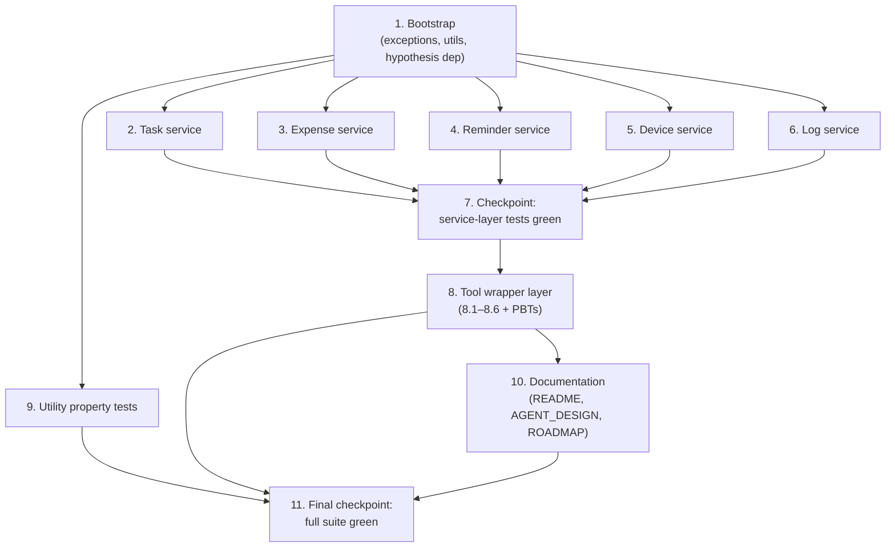

# Implementation Plan

## Overview

Phase 3 menambahkan **Service Layer** (`app/services/`) dan **Tool Wrapper Layer** (`app/tools/`) di atas data layer Phase 2. Service Layer berisi business logic murni yang menerima `Session` SQLAlchemy plus parameter primitif, melakukan validasi, memanipulasi ORM, lalu mengembalikan ORM object atau dict ringan. Tool Wrapper Layer adalah plain Python function yang membungkus pemanggilan service dan menormalisasi hasil/error menjadi *Tool Result Dict* yang ramah agent — bukan tool Google ADK.

Tujuan rencana implementasi ini: men-deliver business logic yang dapat diuji penuh tanpa AI, dengan validasi terkonsentrasi di service layer dan seam tool wrapper yang siap dibungkus ulang oleh Google ADK di Phase 4. Implementasi dipecah menjadi: bootstrap utilitas dan exceptions, lima service domain (task, expense, reminder, device, log), tool wrapper layer, properti utilitas, dokumentasi, dan dua checkpoint untuk memastikan suite tes tetap hijau.

## Tasks

- [x] 1. Bootstrap: dependency, exceptions, dan utilitas
- [x] 1.1 Tambahkan `hypothesis>=6.100` ke `requirements.txt`
  - Edit `requirements.txt` dengan baris baru `hypothesis>=6.100`
  - _Requirements: 9.4_

- [x] 1.2 Buat `app/services/exceptions.py` dengan tiga exception class
  - Definisikan `NotFoundError`, `ValidationError`, `PermissionDeniedError` masing-masing turunan langsung `Exception`
  - _Requirements: 7.1_

- [x] 1.3 Buat `app/utils/__init__.py` (paket kosong)
  - File hanya komentar `# Init` agar `app.utils` menjadi paket
  - _Requirements: 7.2, 8.2_

- [x] 1.4 Buat `app/utils/timezone.py` dengan `now_utc` dan `jakarta_today_window_utc`
  - Import `zoneinfo.ZoneInfo`; konstanta `JAKARTA = ZoneInfo("Asia/Jakarta")`
  - `now_utc()` mengembalikan `datetime.now(timezone.utc)`
  - `jakarta_today_window_utc(now=None)` mengembalikan `(start_utc, end_utc)` di mana keduanya `tzinfo=timezone.utc`, `end-start == 24h`, dan `start.astimezone(JAKARTA)` adalah midnight Jakarta hari kalender `now`
  - _Requirements: 8.1, 8.2_

- [x] 1.5 Buat `app/utils/serialization.py` dengan `model_to_dict`
  - Implementasi pakai `sqlalchemy.inspect(obj).mapper.columns.keys()` untuk mendapatkan kolom mapped saja
  - `datetime` value → `value.isoformat()`; `None` input → `None`
  - _Requirements: 7.2, 7.3_

- [x] 2. Task service
- [x] 2.1 Buat `app/services/task_service.py` dengan `create_task`, `list_tasks`, `mark_task_done`
  - Validasi urutan: user exists → title non-blank → datetime aware → reminder_at not in past
  - `create_task` dengan `reminder_at` non-`None` juga insert `Reminder` (title sama, status `SCHEDULED`) dalam satu transaksi (`db.add` keduanya, satu `commit`)
  - `list_tasks` filter by `user_id`; jika `status` diberikan, tambah filter status
  - `mark_task_done`: missing → `NotFoundError`; mismatch user → `PermissionDeniedError`; sukses → set `TaskStatus.DONE` dan `commit`
  - _Requirements: 1.1, 1.2, 1.3, 1.4, 1.5, 1.6, 1.7, 1.8, 1.9, 1.10, 1.11_

- [x]* 2.2 Property test untuk Task service — Property T1
  - **Feature: service-layer, Property T1: create_task valid invariants**
  - **Validates: Requirements 1.1, 1.2**

- [x]* 2.3 Property test untuk Task service — Property T2
  - **Feature: service-layer, Property T2: create_task ValidationError menolak input invalid**
  - **Validates: Requirements 1.3, 1.5, 1.6**

- [x]* 2.4 Property test untuk Task service — Property T3
  - **Feature: service-layer, Property T3: create_task NotFoundError pada user tidak dikenal**
  - **Validates: Requirements 1.4**

- [x]* 2.5 Property test untuk Task service — Property T4
  - **Feature: service-layer, Property T4: list_tasks mengisolasi user dan menerapkan filter status**
  - **Validates: Requirements 1.7, 1.8**

- [x]* 2.6 Property test untuk Task service — Property T5
  - **Feature: service-layer, Property T5: mark_task_done transisi status menurut otorisasi**
  - **Validates: Requirements 1.9, 1.10, 1.11**

- [x]* 2.7 Unit tests singkat untuk Task service
  - Tulis 1–2 contoh happy-path manusia-readable di `app/tests/test_task_service.py`
  - _Requirements: 1.1, 1.9_

- [x] 3. Expense service
- [x] 3.1 Buat `app/services/expense_service.py` dengan `create_expense`, `list_expenses`, `get_expense_summary`
  - Validasi: user exists; `amount` adalah `int` positif (tolak `bool`); `spent_at` aware atau `None`
  - Bila `spent_at is None`, set ke `now_utc()` sebelum insert
  - `list_expenses` filter `user_id` dan optional `[start_at, end_at]`
  - `get_expense_summary` mengembalikan `{"total": int, "count": int}` konsisten dengan `list_expenses`
  - _Requirements: 2.1, 2.2, 2.3, 2.4, 2.5, 2.6, 2.7, 2.8, 8.1_

- [x]* 3.2 Property test untuk Expense service — Property E1
  - **Feature: service-layer, Property E1: create_expense valid invariants dan default spent_at**
  - **Validates: Requirements 2.1, 2.5, 8.1, 8.3**

- [x]* 3.3 Property test untuk Expense service — Property E2
  - **Feature: service-layer, Property E2: create_expense ValidationError menolak input invalid**
  - **Validates: Requirements 2.2, 2.4**

- [x]* 3.4 Property test untuk Expense service — Property E3
  - **Feature: service-layer, Property E3: create_expense NotFoundError pada user tidak dikenal**
  - **Validates: Requirements 2.3**

- [x]* 3.5 Property test untuk Expense service — Property E4
  - **Feature: service-layer, Property E4: list_expenses window filter benar**
  - **Validates: Requirements 2.6**

- [x]* 3.6 Property test untuk Expense service — Property E5
  - **Feature: service-layer, Property E5: get_expense_summary konsisten dengan list_expenses**
  - **Validates: Requirements 2.7, 2.8**

- [x]* 3.7 Unit tests singkat untuk Expense service
  - 1–2 contoh happy-path di `app/tests/test_expense_service.py`
  - _Requirements: 2.1, 2.7_

- [x] 4. Reminder service
- [x] 4.1 Buat `app/services/reminder_service.py` dengan `create_reminder`, `list_due_reminders`, `mark_reminder_sent`, `mark_reminder_failed`
  - Definisikan `ALLOWED_CHANNELS = ("whatsapp", "device", "both")`
  - Validasi: user exists; title non-blank; `remind_at` aware; `remind_at >= now_utc()`; channel valid; bila `task_id` non-`None`, task ada (`NotFoundError`) dan milik user (`PermissionDeniedError`)
  - `list_due_reminders(now=None)` default `now_utc()`; filter `status == SCHEDULED` dan `remind_at <= now`
  - `mark_reminder_sent`/`mark_reminder_failed`: missing → `NotFoundError`; sukses → set status
  - _Requirements: 3.1, 3.2, 3.3, 3.4, 3.5, 3.6, 3.7, 3.8, 3.9, 3.10, 3.11_

- [x]* 4.2 Property test untuk Reminder service — Property R1
  - **Feature: service-layer, Property R1: create_reminder valid invariants**
  - **Validates: Requirements 3.1**

- [x]* 4.3 Property test untuk Reminder service — Property R2
  - **Feature: service-layer, Property R2: create_reminder ValidationError menolak input invalid**
  - **Validates: Requirements 3.2, 3.4, 3.5, 3.6**

- [x]* 4.4 Property test untuk Reminder service — Property R3
  - **Feature: service-layer, Property R3: create_reminder NotFoundError pada referensi tidak dikenal**
  - **Validates: Requirements 3.3, 3.7**

- [x]* 4.5 Property test untuk Reminder service — Property R4
  - **Feature: service-layer, Property R4: create_reminder PermissionDeniedError saat task milik user lain**
  - **Validates: Requirements 3.7**

- [x]* 4.6 Property test untuk Reminder service — Property R5
  - **Feature: service-layer, Property R5: list_due_reminders filter benar**
  - **Validates: Requirements 3.8**

- [x]* 4.7 Property test untuk Reminder service — Property R6
  - **Feature: service-layer, Property R6: transisi status mark_reminder_***
  - **Validates: Requirements 3.9, 3.10, 3.11**

- [x]* 4.8 Unit tests singkat untuk Reminder service
  - 1–2 contoh happy-path di `app/tests/test_reminder_service.py`
  - _Requirements: 3.1, 3.8_

- [x] 5. Device service
- [x] 5.1 Buat `app/services/device_service.py` dengan semua fungsi device
  - `get_device_by_code`, `queue_device_command`, `list_pending_device_commands`, `mark_device_command_sent`, `ack_device_command`, `update_device_status`
  - `mark_device_command_sent` set `status=SENT`, `sent_at=now_utc()`; `ack_device_command` set `status=ACKNOWLEDGED`, `acknowledged_at=now_utc()`
  - `update_device_status` validasi terhadap `{ONLINE, OFFLINE}`; sukses set `status` dan `last_seen_at=now_utc()`
  - _Requirements: 4.1, 4.2, 4.3, 4.4, 4.5, 4.6, 4.7, 4.8, 4.9, 4.10, 4.11, 8.1_

- [x]* 5.2 Property test untuk Device service — Property D1
  - **Feature: service-layer, Property D1: get_device_by_code roundtrip dan unknown**
  - **Validates: Requirements 4.1, 4.2**

- [x]* 5.3 Property test untuk Device service — Property D2
  - **Feature: service-layer, Property D2: queue_device_command valid invariants**
  - **Validates: Requirements 4.3**

- [x]* 5.4 Property test untuk Device service — Property D3
  - **Feature: service-layer, Property D3: queue_device_command validasi argumen**
  - **Validates: Requirements 4.4, 4.5, 4.6**

- [x]* 5.5 Property test untuk Device service — Property D4
  - **Feature: service-layer, Property D4: list_pending_device_commands filter benar**
  - **Validates: Requirements 4.7**

- [x]* 5.6 Property test untuk Device service — Property D5
  - **Feature: service-layer, Property D5: transisi status mark_device_command_sent dan ack_device_command**
  - **Validates: Requirements 4.8, 4.9, 8.1**

- [x]* 5.7 Property test untuk Device service — Property D6
  - **Feature: service-layer, Property D6: update_device_status valid dan invalid**
  - **Validates: Requirements 4.10, 4.11, 8.1**

- [x]* 5.8 Unit tests singkat untuk Device service
  - 1–2 contoh happy-path di `app/tests/test_device_service.py`
  - _Requirements: 4.3, 4.10_

- [x] 6. Log service
- [x] 6.1 Buat `app/services/log_service.py` dengan `create_voice_command_log`
  - Validasi: `input_text` non-blank; `parsed_actions` JSON-serializable (cek dengan `json.dumps`); user/device existence bila non-`None`
  - Persist baris dan kembalikan
  - _Requirements: 5.1, 5.2, 5.3, 5.4, 5.5, 5.6_

- [x]* 6.2 Property test untuk Log service — Property L1
  - **Feature: service-layer, Property L1: create_voice_command_log valid + roundtrip parsed_actions**
  - **Validates: Requirements 5.1, 5.6**

- [x]* 6.3 Property test untuk Log service — Property L2
  - **Feature: service-layer, Property L2: create_voice_command_log ValidationError pada input invalid**
  - **Validates: Requirements 5.2, 5.5**

- [x]* 6.4 Property test untuk Log service — Property L3
  - **Feature: service-layer, Property L3: create_voice_command_log NotFoundError pada referensi tidak dikenal**
  - **Validates: Requirements 5.3, 5.4**

- [x]* 6.5 Unit test singkat untuk Log service
  - 1 contoh happy-path di `app/tests/test_log_service.py`
  - _Requirements: 5.1_

- [x] 7. Checkpoint — Pastikan semua tes service layer hijau
- Ensure all tests pass, ask the user if questions arise.

- [x] 8. Tool wrapper layer
- [x] 8.1 Buat `app/tools/task_tools.py` dengan `create_task_tool`
  - Try/except `ValidationError`/`NotFoundError`/`PermissionDeniedError` dari service
  - Sukses → dict `{"success": True, "type": "task", "id": task.id, "message": "Tugas berhasil dicatat."}`
  - Gagal → dict `{"success": False, "type": "task", "error": str(e)}`
  - _Requirements: 6.1, 6.7_

- [x] 8.2 Buat `app/tools/expense_tools.py` dengan `create_expense_tool`
  - Pola sama; `type = "expense"`, message Indonesia
  - _Requirements: 6.2, 6.7_

- [x] 8.3 Buat `app/tools/reminder_tools.py` dengan `set_reminder_tool`
  - Pola sama; `type = "reminder"`, message Indonesia
  - _Requirements: 6.3, 6.7_

- [x] 8.4 Buat `app/tools/device_tools.py` dengan `send_device_command_tool`
  - Bangun `payload` dari field non-`None` di antara `face`/`sound`/`text`
  - Bila ketiganya `None` → return `{"success": False, "type": "device_command", "error": "Minimal satu dari face/sound/text harus diisi."}` tanpa memanggil service
  - Tentukan `command_type`: hanya `face` → `"update_face"`; hanya `sound` → `"play_sound"`; hanya `text` → `"show_text"`; campuran → `"composite"`
  - Sukses → `{"success": True, "type": "device_command", "id": command.id, "message": "Perintah device dijadwalkan."}`
  - _Requirements: 6.4, 6.5, 6.7_

- [x] 8.5 Buat `app/tools/summary_tools.py` dengan `get_today_summary_tool`
  - Validasi user via service helper (panggil `task_service.list_tasks` dengan user dummy bisa raise — atau gunakan query langsung lewat existing service lookup; jika user tidak ada → return failure dict)
  - Pakai `jakarta_today_window_utc()` untuk window, hitung `tasks_due_today` dari `Task.deadline_at` dalam window dan `total_expenses_today` dari `Expense.amount` dalam window
  - Return `{"success": True, "type": "summary", "tasks_due_today": int, "total_expenses_today": int, "message": "Ringkasan hari ini siap."}`
  - _Requirements: 6.6, 6.7, 8.2_

- [x] 8.6 Buat `app/tests/conftest.py` jika belum ada, dengan fixture engine in-memory dan session
  - Buat engine `sqlite:///:memory:`, aktifkan `PRAGMA foreign_keys=ON`, panggil `Base.metadata.create_all`
  - Fixture `db_session` mengembalikan `Session` baru per test
  - _Requirements: 9.2_

- [x]* 8.7 Property test untuk Tool wrappers — Property TW1
  - **Feature: service-layer, Property TW1: create_task_tool mengembalikan Tool Result Dict sukses**
  - **Validates: Requirements 6.1**

- [x]* 8.8 Property test untuk Tool wrappers — Property TW2
  - **Feature: service-layer, Property TW2: create_expense_tool mengembalikan Tool Result Dict sukses**
  - **Validates: Requirements 6.2**

- [x]* 8.9 Property test untuk Tool wrappers — Property TW3
  - **Feature: service-layer, Property TW3: set_reminder_tool mengembalikan Tool Result Dict sukses**
  - **Validates: Requirements 6.3**

- [x]* 8.10 Property test untuk Tool wrappers — Property TW4
  - **Feature: service-layer, Property TW4: send_device_command_tool membentuk payload yang konsisten**
  - **Validates: Requirements 6.4**

- [x]* 8.11 Property test untuk Tool wrappers — Property TW5
  - **Feature: service-layer, Property TW5: send_device_command_tool semua None ditolak**
  - **Validates: Requirements 6.5**

- [x]* 8.12 Property test untuk Tool wrappers — Property TW6
  - **Feature: service-layer, Property TW6: get_today_summary_tool cocok dengan window Asia/Jakarta**
  - **Validates: Requirements 6.6, 8.2**

- [x]* 8.13 Property test untuk Tool wrappers — Property TW7
  - **Feature: service-layer, Property TW7: tool wrapper menangkap exception service**
  - **Validates: Requirements 6.7**

- [x] 9. Utility properties
- [x]* 9.1 Property test untuk utilities — Property U1
  - **Feature: service-layer, Property U1: model_to_dict serialisasi konsisten**
  - **Validates: Requirements 7.2, 7.3**

- [x]* 9.2 Property test untuk utilities — Property U2
  - **Feature: service-layer, Property U2: jakarta_today_window_utc invariants**
  - **Validates: Requirements 8.2**

- [x]* 9.3 Unit test untuk service exceptions
  - Cek bahwa `NotFoundError`, `ValidationError`, `PermissionDeniedError` dapat di-`raise`/`except`, dan turunan `Exception`
  - _Requirements: 7.1_

- [x] 10. Dokumentasi
- [x] 10.1 Update `README.md`
  - Tambah catatan bahwa Phase 3 service layer sudah diimplementasikan
  - Tambah / pertegas command `python -m pytest app/tests/ -v`
  - _Requirements: 11.1_

- [x] 10.2 Update `docs/AGENT_DESIGN.md`
  - Tambah catatan bahwa tools saat ini adalah plain Python wrappers di `app/tools/`
  - Tegaskan bahwa integrasi Google ADK ditunda ke Phase 4
  - _Requirements: 11.2_

- [x] 10.3 Update `docs/ROADMAP.md`
  - Pindahkan tanda "Current" dari Phase 2 ke Phase 3
  - _Requirements: 11.3_

- [x] 11. Final checkpoint — Pastikan seluruh suite tes hijau
- Ensure all tests pass, ask the user if questions arise.

## Notes

- Tasks marked with `*` are optional, PBT-only sub-tasks. Core implementation tasks (those without `*`) must be implemented; the optional sub-tasks contain Hypothesis property tests and short happy-path unit tests that can be skipped for a faster MVP path.
- Property-based tests use [Hypothesis](https://hypothesis.readthedocs.io/) (`hypothesis>=6.100`) configured with `@settings(max_examples=100, deadline=None)`. Each PBT sub-task references a specific property (T1–T5, E1–E5, R1–R6, D1–D6, L1–L3, TW1–TW7, U1–U2) defined in `design.md` under "Correctness Properties".
- All tests run against an isolated **in-memory SQLite** database (`sqlite:///:memory:`) created per test via the fixture in `app/tests/conftest.py`, with `PRAGMA foreign_keys=ON` enabled. The suite must never read or write the production `taskbot.db` file.
- Existing tests `test_config.py`, `test_health.py`, and `test_models.py` must continue to pass unmodified. Run the full suite via `python -m pytest app/tests/ -v`.
- Service-layer functions raise typed `NotFoundError`, `ValidationError`, and `PermissionDeniedError` from `app/services/exceptions.py`. Tool wrappers catch only these three exception types and convert them to `{"success": False, "type": ..., "error": str(e)}` dicts; other exceptions (e.g. `IntegrityError`) bubble up.
- Each task references specific granular sub-requirements in `requirements.md` for traceability. Checkpoints (tasks 7 and 11) are reasonable break points to validate that the suite stays green before moving on.

## Task Dependency Graph



```json
{
  "waves": [
    { "id": 0, "tasks": ["2.1", "3.1", "4.1", "5.1", "6.1", "8.6", "9.2", "9.3"] },
    { "id": 1, "tasks": ["2.2", "2.3", "2.4", "2.5", "2.6", "2.7", "3.2", "3.3", "3.4", "3.5", "3.6", "3.7", "4.2", "4.3", "4.4", "4.5", "4.6", "4.7", "4.8", "5.2", "5.3", "5.4", "5.5", "5.6", "5.7", "5.8", "6.2", "6.3", "6.4", "6.5", "9.1"] },
    { "id": 2, "tasks": ["8.1", "8.2", "8.3", "8.4", "8.5"] },
    { "id": 3, "tasks": ["8.7", "8.8", "8.9", "8.10", "8.11", "8.12", "8.13"] },
    { "id": 4, "tasks": ["10.1", "10.2", "10.3"] }
  ]
}
```
